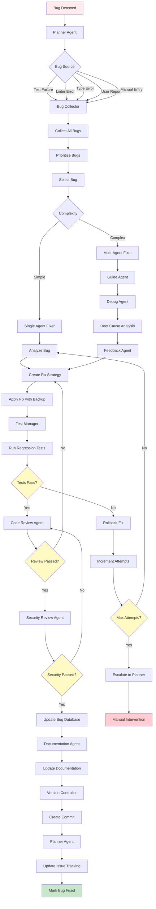

# Bug Fix Workflow

**Version**: 1.0  
**Last Updated**: 2025-01-21  
**Status**: Active  
**Priority**: Standard

---

## Overview

The Bug Fix Workflow defines the systematic process for identifying, analyzing, and fixing bugs in FitVibe. This workflow ensures proper bug collection, root cause analysis, fix implementation, testing, and validation.

---

## Workflow Diagram

---

## Workflow Steps

### Phase 1: Bug Collection & Prioritization (5-10 minutes)

1. **Bug Detection** → Planner Agent
   - Receives bug from various sources:
     - Test failures
     - Linter errors
     - Type checker errors
     - User reports
     - Manual entry
   - Routes to bug collection

2. **Bug Collection** → Bug Collector Script
   - Collects bugs from all sources:
     - Test output (Jest, Vitest)
     - Linter output (ESLint)
     - Type checker output (TypeScript)
     - User reports
   - Stores in bug database (`.cursor/bug-database/bugs.json`)

3. **Bug Prioritization** → Bug Collector Script
   - Prioritizes by:
     1. **Severity**: Critical > High > Medium > Low
     2. **Type**: Type errors > Test failures > Linter errors
     3. **Attempts**: Fewer attempts first
   - Selects next bug to fix

### Phase 2: Bug Analysis (10-30 minutes)

4. **Complexity Assessment** → Planner Agent
   - Determines if bug is simple or complex
   - Routes to appropriate fixer:
     - **Simple**: Single Agent Fixer (basic analysis)
     - **Complex**: Multi-Agent Fixer (RGD pattern)

5. **Simple Bug Analysis** → Single Agent Fixer
   - Analyzes bug context
   - Identifies fix strategy
   - Creates fix plan

6. **Complex Bug Analysis** → Multi-Agent Fixer
   - **Guide Agent**: Analyzes bug, creates fix strategy, coordinates workflow
   - **Debug Agent**: Performs root cause analysis, traces errors, identifies dependencies
   - **Feedback Agent**: Validates fixes, provides feedback, suggests improvements
   - **Brainstorm Agent** (optional): Coordinates multiple LLMs for diverse perspectives

### Phase 3: Fix Implementation (15-60 minutes)

7. **Fix Strategy** → Fix Agent
   - Receives analysis and fix strategy
   - Creates backup of affected files
   - Applies fix following strategy
   - Ensures fix maintains functionality

8. **Regression Testing** → Test Manager
   - Runs full test suite
   - Validates fix doesn't break existing functionality
   - Checks specific bug is resolved

9. **Test Validation** → Test Manager
   - If tests fail:
     - Rolls back fix automatically
     - Increments attempt counter
     - If max attempts reached, escalates to Planner
   - If tests pass, continues to review

### Phase 4: Quality Assurance (15-30 minutes)

10. **Code Review** → Code Review Agent
    - Reviews fix quality
    - Checks standards compliance
    - Validates fix approach
    - If issues found, hands back to fix agent

11. **Security Review** → Security Review Agent
    - Reviews fix for security implications
    - Checks for vulnerabilities introduced
    - Validates security best practices
    - If issues found, hands back to code review agent

### Phase 5: Documentation & Deployment (10-15 minutes)

12. **Bug Database Update** → Bug Collector Script
    - Marks bug as fixed
    - Records fix details
    - Updates fix history
    - Tracks fix metrics

13. **Documentation Update** → Documentation Agent
    - Updates relevant documentation if needed
    - Records fix in issue tracking
    - Updates any affected guides

14. **Version Control** → Version Controller
    - Creates conventional commit (`fix: description`)
    - Creates PR if needed
    - Pushes changes

15. **Project Tracking** → Planner Agent
    - Updates ISSUE_TRACKING.md
    - Marks bug as resolved
    - Updates project status

---

## Workflow Rules

### Mandatory Steps
- ✅ Bug collection is **always** required (no manual fixes without tracking)
- ✅ Regression testing is **always** required (no fixes without validation)
- ✅ Code review is **always** required (no fixes without review)
- ✅ Security review is **always** required (no fixes without security check)
- ✅ Bug database update is **always** required (no fixes without tracking)

### Conditional Steps
- ⚠️ Multi-agent fixer only for complex bugs
- ⚠️ Brainstorm agent only for very complex bugs
- ⚠️ Documentation update only if fix affects documentation
- ⚠️ PR creation only if multiple files changed or significant fix

### Handoff Criteria
- **Collection → Analysis**: Bugs collected and prioritized
- **Analysis → Fix**: Fix strategy defined, root cause identified
- **Fix → Testing**: Fix applied, backup created
- **Testing → Review**: Tests pass, no regressions
- **Review → Security**: Code review passed, no blocking issues
- **Security → Documentation**: Security review passed
- **Documentation → Version Control**: Documentation updated
- **Version Control → Complete**: Commit created, bug marked fixed

---

## Error Handling

### If Bug Collection Fails
- Bug Collector logs error
- Escalates to Planner if persistent
- Allows manual bug entry as fallback

### If Analysis Fails
- Single Agent Fixer escalates to Multi-Agent Fixer
- Multi-Agent Fixer escalates to Planner if still blocked
- Documents blockers in bug database

### If Fix Fails
- Automatic rollback to backup
- Increment attempt counter
- If max attempts (3) reached, escalate to Planner
- Document failure reason in bug database

### If Tests Fail
- Automatic rollback
- Fix agent receives test output
- Retries with additional context
- Escalates if max attempts reached

### If Review Fails
- Code Review Agent provides feedback
- Hands back to fix agent
- Repeats until review passes

### If Security Review Fails
- Security Review Agent provides feedback
- Hands back to code review agent
- Repeats until security review passes

---

## Success Criteria

Workflow is complete when:
- ✅ Bug identified and collected
- ✅ Root cause analyzed
- ✅ Fix implemented and tested
- ✅ All reviews passed (code, security)
- ✅ Bug database updated
- ✅ Documentation updated (if needed)
- ✅ Changes committed
- ✅ Issue tracking updated
- ✅ Bug marked as fixed

---

## Bug Prioritization Algorithm

Bugs are prioritized using this algorithm:

1. **Severity Score**:
   - Critical: 100 points
   - High: 75 points
   - Medium: 50 points
   - Low: 25 points

2. **Type Score**:
   - Type error: 30 points
   - Test failure: 20 points
   - Linter error: 10 points
   - Other: 5 points

3. **Attempt Penalty**:
   - 0 attempts: 0 penalty
   - 1 attempt: -5 points
   - 2 attempts: -10 points
   - 3+ attempts: -20 points

**Total Score** = Severity + Type - Attempt Penalty

Bugs with higher scores are fixed first.

---

## Metrics

- **Average Duration**: 30-90 minutes (depending on complexity)
- **Success Rate**: Target 90%+ (first pass)
- **Rework Rate**: Target <15% (due to review failures)
- **Max Attempts**: 3 per bug before escalation
- **Collection Coverage**: 100% (all sources monitored)

---

## Safety Mechanisms

1. **File Backups**: All files backed up before modification (`.bug-fix-backup`)
2. **Automatic Rollback**: Changes reverted if tests fail
3. **Attempt Limiting**: Maximum 3 attempts per bug
4. **Status Tracking**: Complete fix history in bug database
5. **Regression Testing**: Full test suite after each fix
6. **Review Gates**: Code and security reviews required

---

## Related Workflows

- **Feature Development Workflow**: For implementing new features
- **Emergency Hotfix Workflow**: For critical production issues

---

## Integration with Existing Tools

This workflow integrates with:
- **Bug Collector**: `.cursor/scripts/bug-collector.mjs`
- **Single Agent Fixer**: `.cursor/scripts/bug-fixer-agent.mjs`
- **Multi-Agent Fixer**: `.cursor/scripts/bug-fixer-multi-agent.mjs`
- **Bug Database**: `.cursor/bug-database/bugs.json`
- **Commands**: `/bug:collect`, `/bug:fix`, `/bug:fix:multi`

---

**Last Updated**: 2025-01-21

