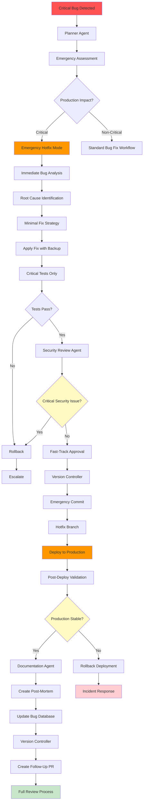

# Emergency Hotfix Workflow

**Version**: 1.0  
**Last Updated**: 2025-01-21  
**Status**: Active  
**Priority**: Emergency

---

## Overview

The Emergency Hotfix Workflow defines an expedited process for fixing critical production issues that require immediate resolution. This workflow bypasses normal review gates while maintaining essential safety mechanisms.

---

## Workflow Diagram

---

## Workflow Steps

### Phase 1: Emergency Assessment (2-5 minutes)

1. **Critical Bug Detection** → Planner Agent
   - Receives critical bug report
   - Assesses production impact
   - Determines if emergency hotfix needed

2. **Emergency Mode Activation** → Planner Agent
   - Activates emergency hotfix workflow
   - Bypasses normal review gates
   - Maintains essential safety mechanisms

### Phase 2: Rapid Analysis & Fix (10-30 minutes)

3. **Immediate Analysis** → Debug Agent / Fix Agent
   - Rapid root cause analysis
   - Identifies minimal fix required
   - Focuses on stopping the issue, not perfect solution

4. **Minimal Fix Strategy** → Fix Agent
   - Creates minimal fix to resolve issue
   - Prioritizes stability over perfection
   - Documents full fix for follow-up

5. **Fix Application** → Fix Agent
   - Creates backup of affected files
   - Applies minimal fix
   - Ensures fix stops the issue

### Phase 3: Critical Validation (5-15 minutes)

6. **Critical Tests Only** → Test Manager
   - Runs only critical/affected tests
   - Skips full regression suite
   - Validates fix resolves issue
   - If tests fail, rollback immediately

7. **Security Check** → Security Review Agent
   - Quick security review
   - Checks for critical vulnerabilities
   - If critical security issue, blocks deployment
   - Non-critical issues documented for follow-up

### Phase 4: Emergency Deployment (5-10 minutes)

8. **Fast-Track Approval** → Approval Manager
   - Emergency approval (if required)
   - Reduced timeout (5 minutes vs 60)
   - Auto-approve if no response

9. **Emergency Commit** → Version Controller
   - Creates emergency commit (`hotfix: description`)
   - Creates hotfix branch (`hotfix/critical-issue`)
   - Pushes immediately

10. **Deploy to Production** → Version Controller / CI/CD
    - Deploys hotfix to production
    - Monitors deployment
    - Validates deployment success

### Phase 5: Post-Deploy & Follow-Up (30-60 minutes)

11. **Post-Deploy Validation** → Test Manager / Monitoring
    - Validates production is stable
    - Monitors error rates
    - Checks key metrics
    - If unstable, rollback immediately

12. **Post-Mortem Creation** → Documentation Agent
    - Documents incident
    - Records root cause
    - Documents fix applied
    - Identifies follow-up actions

13. **Bug Database Update** → Bug Collector
    - Marks bug as fixed (hotfix)
    - Records hotfix details
    - Flags for follow-up review

14. **Follow-Up PR** → Version Controller
    - Creates follow-up PR with full fix
    - Goes through standard review process
    - Replaces hotfix with proper solution

---

## Workflow Rules

### Emergency Criteria

Emergency hotfix is triggered when:
- ✅ **Production Down**: Service unavailable or severely degraded
- ✅ **Data Loss Risk**: Potential for data corruption or loss
- ✅ **Security Breach**: Active security vulnerability being exploited
- ✅ **Compliance Violation**: Regulatory or compliance issue
- ✅ **Critical Business Impact**: Significant revenue or user impact

### Expedited Steps
- ⚡ **Analysis**: 10-30 minutes (vs 30-60 for standard)
- ⚡ **Testing**: Critical tests only (vs full suite)
- ⚡ **Review**: Security only (vs code + security)
- ⚡ **Approval**: 5-minute timeout (vs 60 minutes)
- ⚡ **Deployment**: Immediate (vs standard release cycle)

### Safety Mechanisms (Still Required)
- ✅ **File Backups**: Always create backups
- ✅ **Test Validation**: Critical tests must pass
- ✅ **Security Check**: Security review required
- ✅ **Rollback Plan**: Always available
- ✅ **Post-Deploy Monitoring**: Validate stability

### Bypassed Steps (For Speed)
- ⏭️ **Full Regression Testing**: Only critical tests
- ⏭️ **Code Review**: Skipped (done in follow-up)
- ⏭️ **Full Documentation**: Post-mortem created after
- ⏭️ **Standard Approval**: Fast-track approval only

---

## Error Handling

### If Analysis Fails
- Escalate immediately to senior developer
- Document what was attempted
- Consider rollback of recent changes

### If Fix Fails
- Rollback immediately
- Document failure
- Escalate to incident response

### If Tests Fail
- Rollback fix immediately
- Reassess approach
- Consider alternative fix or rollback of recent changes

### If Security Check Fails
- **Critical**: Block deployment, rollback
- **Non-Critical**: Document, proceed with caution

### If Deployment Fails
- Rollback deployment immediately
- Investigate deployment issue
- Retry or use alternative deployment method

### If Production Unstable
- Rollback deployment immediately
- Restore previous version
- Document incident
- Begin incident response

---

## Success Criteria

Emergency hotfix is complete when:
- ✅ Critical issue resolved in production
- ✅ Production stable and monitored
- ✅ Post-mortem created
- ✅ Bug database updated
- ✅ Follow-up PR created for full fix

---

## Follow-Up Process

After emergency hotfix:

1. **Within 24 Hours**:
   - Full code review of hotfix
   - Complete test suite run
   - Security review completion
   - Documentation update

2. **Within 1 Week**:
   - Follow-up PR with proper fix
   - Root cause analysis
   - Prevention measures implemented
   - Process improvements documented

---

## Metrics

- **Target Resolution Time**: < 1 hour (from detection to deployment)
- **Rollback Rate**: Target < 5% (hotfixes that need rollback)
- **Follow-Up Completion**: 100% (all hotfixes get proper fix)
- **Incident Rate**: Track and reduce over time

---

## Related Workflows

- **Bug Fix Workflow**: Standard bug fixing process
- **Feature Development Workflow**: For implementing new features
- **Incident Response**: For managing production incidents

---

**Last Updated**: 2025-01-21

