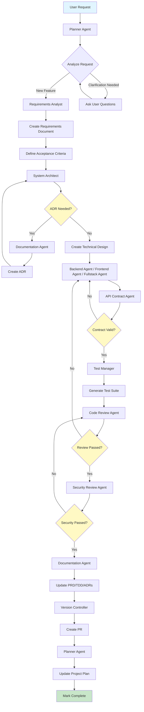

# Feature Development Workflow

**Version**: 1.0
**Last Updated**: 2025-01-21
**Status**: Active
**Priority**: Standard

---

## Overview

The Feature Development Workflow defines the standard process for implementing new features in FitVibe. This workflow ensures proper requirements analysis, technical design, implementation, testing, and documentation.

---

## Workflow Diagram

---

## Workflow Steps

### Phase 1: Requirements & Design (30-45 minutes)

1. **User Request** → Planner Agent
   - Receives user request
   - Analyzes scope and complexity
   - Determines if clarification needed

2. **Requirements Analysis** → Requirements Analyst Agent
   - Always hand off to requirements-analyst-agent
   - Creates requirements document
   - Defines acceptance criteria
   - Identifies dependencies and constraints

3. **Technical Design** → System Architect Agent
   - Creates API contracts
   - Designs data models
   - Plans module structure
   - Identifies integration points

4. **ADR Creation** (if needed) → Documentation Agent
   - System Architect identifies if ADR needed
   - Hands off to documentation-agent
   - Documentation agent creates ADR
   - Hands back to System Architect

### Phase 2: Implementation (1-4 hours)

5. **Implementation** → Backend/Frontend/Fullstack Agent
   - Receives technical design
   - Implements feature following design
   - Creates migrations (if needed)
   - Implements API endpoints
   - Implements UI components

6. **API Contract Validation** → API Contract Agent
   - Validates API contracts match implementation
   - Checks TypeScript types vs Zod schemas
   - Verifies backward compatibility
   - If invalid, hands back to implementation agent

### Phase 3: Quality Assurance (30-60 minutes)

7. **Test Generation** → Test Manager
   - Generates comprehensive test suite
   - Unit tests, integration tests, E2E tests
   - Ensures ≥80% coverage (≥90% for critical paths)

8. **Code Review** → Code Review Agent
   - Reviews code quality
   - Checks standards compliance
   - Validates architecture
   - If issues found, hands back to implementation agent

9. **Security Review** → Security Review Agent
   - Comprehensive security review
   - OWASP Top 10 checks
   - Dependency vulnerability scanning
   - If issues found, hands back to code review agent

### Phase 4: Documentation & Deployment (15-30 minutes)

10. **Documentation Update** → Documentation Agent
    - Updates PRD with feature details
    - Updates TDD with technical changes
    - Updates ADRs if needed
    - Updates RTM (Requirements Traceability Matrix)

11. **Version Control** → Version Controller
    - Creates conventional commit
    - Creates PR with description
    - Runs security scanning
    - Pushes to repository

12. **Project Tracking** → Planner Agent
    - Updates PROJECT_EPICS_AND_ACTIVITIES.md
    - Updates ISSUE_TRACKING.md
    - Marks feature as complete

---

## Workflow Rules

### Mandatory Steps (ALL REQUIRED - NO STOPPING UNTIL ALL COMPLETE)
- ✅ Requirements analysis is **always** required (no skipping)
- ✅ Technical design is **always** required (no direct implementation)
- ✅ Implementation must include **BOTH backend AND frontend** (if feature requires both)
- ✅ API contract validation is **always** required for API changes
- ✅ Test generation is **always** required
- ✅ Code review is **always** required
- ✅ Security review is **always** required
- ✅ Documentation update is **always** required
- ✅ Version control (PR creation) is **always** required

**CRITICAL**: The workflow MUST continue through ALL steps without stopping. Agents must hand off automatically until the entire workflow is complete. Never stop after backend implementation, after testing, or at any intermediate step.

### Conditional Steps
- ⚠️ ADR creation only if significant architectural decision
- ⚠️ Backend/Frontend split only if feature spans both layers
- ⚠️ Fullstack agent can handle simple features end-to-end

### Handoff Criteria
- **Requirements → Design**: Requirements complete, acceptance criteria defined
- **Design → Implementation**: Technical design complete, ADR created (if needed)
- **Implementation → Testing**: Code complete, passes linting and type checking
- **Testing → Review**: Tests pass, coverage meets requirements
- **Review → Security**: Code review passed, no blocking issues
- **Security → Documentation**: Security review passed
- **Documentation → Version Control**: Documentation updated
- **Version Control → Complete**: PR created, project plan updated

---

## Error Handling

### If Requirements Incomplete
- Requirements Analyst asks clarifying questions
- Escalates to Planner if user unavailable
- Blocks workflow until requirements complete

### If Design Conflicts
- System Architect creates ADR
- Escalates to Planner if major conflict
- Documents decision and continues

### If Implementation Fails
- Implementation agent retries with guidance
- Escalates to Planner if blocked
- Documents blockers in issue tracking

### If Tests Fail
- Test Manager identifies failures
- Hands back to implementation agent
- Repeats until tests pass

### If Review Fails
- Code Review Agent provides feedback
- Hands back to implementation agent
- Repeats until review passes

---

## Success Criteria

Workflow is complete when:
- ✅ Feature implemented and tested
- ✅ All reviews passed (code, security)
- ✅ Documentation updated
- ✅ PR created and ready for review
- ✅ Project plan updated
- ✅ Issue tracking updated

---

## Metrics

- **Average Duration**: 2-6 hours (depending on complexity)
- **Success Rate**: Target 95%+ (first pass)
- **Rework Rate**: Target <10% (due to review failures)

---

## Related Workflows

- **Bug Fix Workflow**: For fixing bugs in existing features
- **Emergency Hotfix Workflow**: For critical production issues

---

**Last Updated**: 2025-01-21

