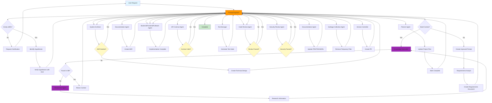

# Feature Development Workflow

**Version**: 1.1
**Last Updated**: 2025-12-13
**Status**: Active
**Priority**: Standard
**Changes in v1.1**: Added parallelization, caching strategy, conditional execution, event emission specs, and observability (Priority 2 efficiency improvements)

---

## Overview

The Feature Development Workflow defines the standard process for implementing new features in FitVibe. This workflow ensures proper requirements analysis, technical design, implementation, testing, and documentation.

**Key Architecture Principle**: The Prompt Engineer makes **context-specific queries** to the Knowledge Specialist at every step, ensuring agents only receive relevant information for their domain. For example:
- Backend Agent receives **only** backend context (no frontend code/patterns)
- Frontend Agent receives **only** frontend context (no backend implementation details)
- Test Manager receives context specific to what's being tested (frontend tests = frontend context, backend tests = backend context)

---

## Workflow Diagram



---

## Context-Specific Querying

**CRITICAL**: At every step, the Prompt Engineer makes context-specific queries to the Knowledge Specialist based on the target agent's domain and task requirements.

**Key Principles**:
- **Backend Agent** receives only backend context (no frontend patterns/code)
- **Frontend Agent** receives only frontend context (no backend implementation details)
- **Test Manager** receives context based on test type (frontend tests = frontend context, backend tests = backend context)
- **Requirements Analyst** receives only requirements patterns (no implementation details)
- **System Architect** receives only architecture patterns (no implementation code)

See `CONTEXT_FILTERING_GUIDE.md` for detailed context filtering rules for each agent type.

---

## Workflow Steps

**CRITICAL ARCHITECTURE**: All communication flows through the **Prompt Engineer**. Agents NEVER handoff directly to each other. All handoffs go through prompt-engineer, who:
1. Receives handoff from agent
2. Assesses clarity and improves prompt
3. Makes **context-specific queries** to knowledge-specialist based on:
   - **Target agent type** (backend, frontend, fullstack, test-manager, etc.)
   - **Task domain** (backend implementation, frontend testing, API design, etc.)
   - **Required context scope** (only relevant information for the target agent)
4. Queries documentation agent for documentation templates/patterns (if needed)
5. Uses researcher agent if information not found in knowledge base
6. Routes improved prompt with filtered, relevant context to next agent

**Context Filtering Rules**:
- **Backend Agent** → Only backend context (API patterns, database schemas, backend modules, no frontend code)
- **Frontend Agent** → Only frontend context (React components, UI patterns, frontend services, no backend implementation)
- **Fullstack Agent** → Both backend and frontend context (complete feature context)
- **Test Manager** → Context specific to what's being tested:
  - Frontend tests → Frontend context (components, services, UI patterns)
  - Backend tests → Backend context (modules, services, database, no frontend)
  - Integration tests → Both backend and frontend context
- **Requirements Analyst** → Requirements templates, user story patterns, acceptance criteria formats (no implementation details)
- **System Architect** → Architecture patterns, ADR templates, API design patterns, data modeling (no specific implementation code)
- **Code Review Agent** → Code quality standards, review checklists, patterns for the code type being reviewed
- **Security Review Agent** → Security standards, OWASP patterns, security checklists
- **API Contract Agent** → API contract patterns, Zod/TypeScript alignment patterns
- **Documentation Agent** → Documentation templates, PRD/TDD structures, ADR formats

### Phase 1: Requirements & Design (30-45 minutes)

1. **User Request** → Prompt Engineer
   - Receives user request
   - Assesses prompt clarity (must achieve ≥80% clarity)
   - If clarity < 80%, requests clarification from user
   - Identifies and makes explicit all hypotheses
   - Verifies hypotheses with user
   - Makes **initial context query** to knowledge-specialist for general project context (workflow patterns, project structure) if needed
   - If context not found in database, queries researcher agent
   - Creates improved, clarified prompt for routing to first agent (Requirements Analyst)

2. **Requirements Analysis** → Prompt Engineer → Requirements Analyst Agent
   - Prompt Engineer routes to requirements-analyst-agent
   - Requirements Analyst creates requirements document
   - Defines acceptance criteria
   - Identifies dependencies and constraints
   - **Hands off to Prompt Engineer** (never directly to next agent)

3. **Technical Design** → Prompt Engineer → System Architect Agent
   - Prompt Engineer receives handoff from Requirements Analyst
   - Makes **context-specific query** to knowledge-specialist:
     - Queries for architecture patterns (API design patterns, data modeling patterns, ADR templates, technical design document structures)
     - **Excludes** specific implementation code, detailed component code
     - Focuses on design patterns, architectural decisions, contract specifications
   - Routes improved prompt with architecture-focused context to system-architect-agent
   - System Architect creates API contracts
   - Designs data models
   - Plans module structure
   - Identifies integration points
   - **Hands off to Prompt Engineer** (never directly to next agent)

4. **ADR Creation** (if needed) → Prompt Engineer → Documentation Agent → Prompt Engineer → System Architect
   - System Architect hands off to Prompt Engineer
   - Prompt Engineer determines if ADR needed
   - If yes, Prompt Engineer queries knowledge-specialist for ADR context
   - Routes to documentation-agent
   - Documentation agent creates ADR
   - **Hands off to Prompt Engineer**
   - Prompt Engineer routes back to System Architect with ADR context

### Phase 2: Implementation (1-4 hours)

5. **Implementation** → Prompt Engineer → Backend/Frontend/Fullstack Agent
   - Prompt Engineer receives handoff from System Architect
   - Determines which agent(s) needed (backend, frontend, or fullstack)
   - Makes **context-specific queries** to knowledge-specialist:
     - **Backend Agent**: Only backend patterns (module structure, controller/service/repository patterns, database migrations, API endpoint patterns, Zod schemas)
     - **Frontend Agent**: Only frontend patterns (React component patterns, API service patterns, React Query hooks, UI component library patterns, i18n patterns)
     - **Fullstack Agent**: Both backend and frontend patterns (complete feature implementation patterns)
   - If patterns not found, queries researcher agent for best practices
   - Filters context to only relevant information for target agent
   - Routes improved prompt with filtered context to appropriate agent
   - Agent receives technical design with **only relevant context** for their domain
   - Agent implements feature following design
   - Creates migrations (if backend/fullstack)
   - Implements API endpoints (if backend/fullstack)
   - Implements UI components (if frontend/fullstack)
   - **Hands off to Prompt Engineer** (never directly to next agent)

6. **API Contract Validation** → Prompt Engineer → API Contract Agent
   - Prompt Engineer receives handoff from Implementation Agent
   - Makes **context-specific query** to knowledge-specialist:
     - Queries for API contract validation patterns (Zod schema patterns, TypeScript type patterns, contract validation strategies)
     - **Includes** both backend Zod schemas and frontend TypeScript types if applicable
     - Focuses on contract alignment patterns, not implementation details
   - Routes to api-contract-agent with contract-focused context
   - API Contract Agent validates contracts match implementation
   - Checks TypeScript types vs Zod schemas
   - Verifies backward compatibility
   - **Hands off to Prompt Engineer** (never directly)
   - If invalid, Prompt Engineer routes back to implementation agent with feedback

### Phase 3: Quality Assurance (30-60 minutes)

7. **Test Generation** → Prompt Engineer → Test Manager
   - Prompt Engineer receives handoff from API Contract Agent
   - Determines what needs testing (backend, frontend, or both)
   - Makes **context-specific queries** to knowledge-specialist based on test scope:
     - **Frontend tests needed**: Queries for frontend test patterns (React Testing Library, component testing, API mocking, React Query testing, Vitest patterns)
     - **Backend tests needed**: Queries for backend test patterns (Jest, Supertest, database testing, service mocking, pg-mem patterns)
     - **Integration tests needed**: Queries for both backend and frontend test patterns
     - **E2E tests needed**: Queries for Playwright patterns, E2E testing strategies
   - Filters context to only relevant test patterns for what's being tested
   - Routes to test-manager with filtered, relevant test context
   - Test Manager generates comprehensive test suite with appropriate patterns
   - Unit tests, integration tests, E2E tests
   - Ensures ≥80% coverage (≥90% for critical paths)
   - **Hands off to Prompt Engineer** (never directly to next agent)

8. **Code Review** → Prompt Engineer → Code Review Agent
   - Prompt Engineer receives handoff from Test Manager
   - Determines what code needs review (backend code, frontend code, or both)
   - Makes **context-specific queries** to knowledge-specialist:
     - **Backend code review**: Queries for backend review standards (TypeScript strict mode, Controller→Service→Repository pattern, Zod validation, Knex patterns, backend testing standards)
     - **Frontend code review**: Queries for frontend review standards (React patterns, accessibility (WCAG 2.1 AA), i18n usage, React Query patterns, frontend testing standards)
     - **Full code review**: Queries for both backend and frontend review standards
   - Filters context to only relevant review standards for the code type
   - Routes to code-review-agent with filtered, relevant review context
   - Code Review Agent reviews code quality using appropriate standards
   - Checks standards compliance for the specific code type
   - Validates architecture
   - **Hands off to Prompt Engineer** (never directly)
   - If issues found, Prompt Engineer routes back to implementation agent with feedback

9. **Security Review** → Prompt Engineer → Security Review Agent
   - Prompt Engineer receives handoff from Code Review Agent
   - Determines what code needs security review (backend, frontend, or both)
   - Makes **context-specific query** to knowledge-specialist:
     - Queries for security standards and patterns (OWASP Top 10, security checklists, vulnerability patterns)
     - **Backend security**: Focuses on API security, authentication, authorization, SQL injection prevention, input validation
     - **Frontend security**: Focuses on XSS prevention, CSRF protection, secure API calls, client-side security
     - **Full security review**: Both backend and frontend security patterns
   - Routes to security-review-agent with filtered, relevant security context
   - Security Review Agent performs comprehensive security review using appropriate security standards
   - OWASP Top 10 checks
   - Dependency vulnerability scanning
   - **Hands off to Prompt Engineer** (never directly)
   - If issues found, Prompt Engineer routes back to code review agent

### Phase 4: Documentation & Deployment (15-30 minutes)

10. **Documentation Update** → Prompt Engineer → Documentation Agent
    - Prompt Engineer receives handoff from Security Review Agent
    - Makes **context-specific query** to knowledge-specialist:
      - Queries for documentation templates and patterns (PRD structure, TDD structure, ADR templates, RTM formats)
      - **Excludes** implementation code, focuses on documentation structures and formats
      - Includes feature context needed for documentation (requirements, technical decisions, API contracts)
    - Routes to documentation-agent with documentation-focused context
    - Documentation Agent updates PRD with feature details
    - Updates TDD with technical changes
    - Updates ADRs if needed
    - Updates RTM (Requirements Traceability Matrix)
    - **Hands off to Prompt Engineer** (never directly to next agent)

11. **Garbage Collection** → Prompt Engineer → Garbage Collection Agent
    - Prompt Engineer receives handoff from Documentation Agent
    - Routes to garbage-collection-agent
    - Garbage Collection Agent removes temporary files created during workflow
    - **Hands off to Prompt Engineer** (never directly)

12. **Version Control** → Prompt Engineer → Version Controller
    - Prompt Engineer receives handoff from Garbage Collection Agent
    - Queries knowledge-specialist for commit/PR patterns (if needed)
    - Routes to version-controller
    - Version Controller creates conventional commit
    - Creates PR with description
    - Runs security scanning
    - Pushes to repository
    - **Hands off to Prompt Engineer** (never directly)

13. **Project Tracking** → Prompt Engineer → Planner Agent
    - Prompt Engineer receives handoff from Version Controller
    - Queries knowledge-specialist for project tracking patterns (if needed)
    - Routes to planner-agent
    - Planner Agent updates PROJECT_EPICS_AND_ACTIVITIES.md
    - Updates ISSUE_TRACKING.md
    - Marks feature as complete
    - **Hands off to Prompt Engineer** (never directly)

---

## Workflow Rules

### Mandatory Steps (ALL REQUIRED - NO STOPPING UNTIL ALL COMPLETE)
- ✅ Requirements analysis is **always** required (no skipping)
- ✅ Technical design is **always** required (no direct implementation)
- ✅ Implementation must include **BOTH backend AND frontend** (if feature requires both)
- ✅ API contract validation is **always** required for API changes
- ✅ Test generation is **always** required
- ✅ Code review is **always** required
- ✅ Security review is **always** required
- ✅ Documentation update is **always** required
- ✅ Garbage collection (temporary file cleanup) is **always** required after documentation
- ✅ Version control (PR creation) is **always** required

**CRITICAL ARCHITECTURE RULES**:
1. **All agents ALWAYS handoff to Prompt Engineer** - Never directly to other agents
2. **Prompt Engineer is the central hub** - All communication flows through prompt-engineer
3. **Context-specific queries** - Prompt Engineer makes domain-specific queries to knowledge-specialist based on target agent type:
   - **Backend Agent** → Only backend context (no frontend)
   - **Frontend Agent** → Only frontend context (no backend)
   - **Fullstack Agent** → Both backend and frontend context
   - **Test Manager** → Context based on test type (frontend tests = frontend context, backend tests = backend context)
   - **Requirements Analyst** → Requirements patterns only (no implementation details)
   - **System Architect** → Architecture patterns only (no implementation code)
   - **Code Review Agent** → Review standards for the code type being reviewed
   - **Security Review Agent** → Security patterns for the code type being reviewed
4. **Research fallback** - If information not found in knowledge base, Prompt Engineer queries researcher agent with domain-specific query
5. **Documentation context** - Prompt Engineer queries documentation agent for documentation templates/patterns when needed
6. **Prompt improvement** - Prompt Engineer improves all prompts to ≥80% clarity before routing
7. **Workflow continuation** - The workflow MUST continue through ALL steps without stopping. Agents hand off through Prompt Engineer automatically until the entire workflow is complete.

**Context Filtering Examples**:
- When routing to **Backend Agent**: Query knowledge-specialist with filter for "backend patterns, API endpoints, database migrations, Zod schemas" → **Exclude** frontend code, React patterns, UI components
- When routing to **Frontend Agent**: Query knowledge-specialist with filter for "React components, API services, React Query, UI patterns" → **Exclude** backend implementation, database schemas, API route handlers
- When routing to **Test Manager for frontend tests**: Query knowledge-specialist with filter for "React Testing Library, component testing, frontend test patterns" → **Exclude** backend test patterns, Jest/Supertest patterns
- When routing to **Test Manager for backend tests**: Query knowledge-specialist with filter for "Jest, Supertest, backend test patterns, pg-mem" → **Exclude** frontend test patterns, React Testing Library

### Conditional Steps
- ⚠️ ADR creation only if significant architectural decision
- ⚠️ Backend/Frontend split only if feature spans both layers
- ⚠️ Fullstack agent can handle simple features end-to-end

### Handoff Protocol

**CRITICAL**: All handoffs ALWAYS go through Prompt Engineer:

1. **Agent completes work** → Hands off to Prompt Engineer (never directly to next agent)
2. **Prompt Engineer receives handoff** → Assesses clarity, improves prompt
3. **Prompt Engineer makes context-specific query** (if needed):
   - **Identifies target agent type** and domain (backend, frontend, fullstack, testing, etc.)
   - **Formulates domain-specific query** to knowledge-specialist:
     - Specifies what information is needed (domain-specific)
     - Explicitly excludes irrelevant domains (e.g., "EXCLUDE frontend patterns" for backend agent)
   - **Knowledge-specialist filters** and returns only relevant context
   - **If information not found** in knowledge base → queries researcher agent with same domain filters
   - **Queries documentation agent** for documentation templates/patterns (if needed)
4. **Prompt Engineer routes** → Sends improved prompt with **filtered, relevant context** to next agent

### Handoff Criteria
- **Requirements → Design**: Requirements complete, acceptance criteria defined → Requirements Analyst hands off to Prompt Engineer → Prompt Engineer routes to System Architect
- **Design → Implementation**: Technical design complete, ADR created (if needed) → System Architect hands off to Prompt Engineer → Prompt Engineer routes to Implementation Agent
- **Implementation → API Validation**: Code complete, passes linting and type checking → Implementation Agent hands off to Prompt Engineer → Prompt Engineer routes to API Contract Agent
- **API Validation → Testing**: API contracts validated → API Contract Agent hands off to Prompt Engineer → Prompt Engineer routes to Test Manager
- **Testing → Review**: Tests pass, coverage meets requirements → Test Manager hands off to Prompt Engineer → Prompt Engineer routes to Code Review Agent
- **Review → Security**: Code review passed, no blocking issues → Code Review Agent hands off to Prompt Engineer → Prompt Engineer routes to Security Review Agent
- **Security → Documentation**: Security review passed → Security Review Agent hands off to Prompt Engineer → Prompt Engineer routes to Documentation Agent
- **Documentation → Garbage Collection**: Documentation updated → Documentation Agent hands off to Prompt Engineer → Prompt Engineer routes to Garbage Collection Agent
- **Garbage Collection → Version Control**: Temporary files removed → Garbage Collection Agent hands off to Prompt Engineer → Prompt Engineer routes to Version Controller
- **Version Control → Project Tracking**: PR created → Version Controller hands off to Prompt Engineer → Prompt Engineer routes to Planner Agent
- **Project Tracking → Complete**: Project plan updated → Planner Agent hands off to Prompt Engineer → Workflow complete

---

## Error Handling

### If Requirements Incomplete
- Requirements Analyst asks clarifying questions
- Escalates to Planner if user unavailable
- Blocks workflow until requirements complete

### If Design Conflicts
- System Architect creates ADR
- Escalates to Planner if major conflict
- Documents decision and continues

### If Implementation Fails
- Implementation agent retries with guidance
- Escalates to Planner if blocked
- Documents blockers in issue tracking

### If Tests Fail
- Test Manager identifies failures
- Hands back to implementation agent
- Repeats until tests pass

### If Review Fails
- Code Review Agent provides feedback
- Hands back to implementation agent
- Repeats until review passes

---

## Success Criteria

Workflow is complete when:
- ✅ Feature implemented and tested
- ✅ All reviews passed (code, security)
- ✅ Documentation updated
- ✅ PR created and ready for review
- ✅ Project plan updated
- ✅ Issue tracking updated

---

## Parallelization & Efficiency

### Parallel Execution Opportunities

To reduce workflow duration, the following steps can execute in parallel when dependencies allow:

#### Phase 1: Requirements & Design
- **Context Query + Requirements Analysis**: Initial context query can happen while requirements analysis begins (if context is not blocking)
- **Technical Design + ADR Preparation**: If ADR is likely needed, documentation agent can prepare templates in parallel with design

#### Phase 2: Implementation
- **Backend + Frontend Implementation**: If feature spans both layers, backend and frontend agents can work in parallel after technical design
  - Dependency: Both need technical design complete
  - Handoff: Both agents hand off independently to Prompt Engineer
  - Merge: Prompt Engineer merges both handoffs before API validation

#### Phase 3: Quality Assurance
- **Test Generation + Documentation Drafting**: Test generation and initial documentation drafting can start in parallel after implementation
  - Dependency: Both need implementation complete
  - Coordination: Documentation agent drafts initial docs while tests are generated

#### Phase 4: Documentation & Deployment
- **Garbage Collection + Version Control Preparation**: Garbage collection can run while preparing version control (commit message, PR description)
  - Dependency: Both need documentation complete
  - Sequential constraint: Version control waits for garbage collection to complete (to ensure no temp files in commit)

### Dependency Graph

```
User Request → Prompt Engineer
  ↓
Requirements Analysis (can parallelize with context query if non-blocking)
  ↓
Technical Design
  ↓
├─→ Backend Implementation ──┐
│                            ├─→ Prompt Engineer (merge)
└─→ Frontend Implementation ─┘
  ↓
API Contract Validation
  ↓
├─→ Test Generation ──────────┐
│                             ├─→ Code Review
└─→ Documentation Drafting ───┘
  ↓
Security Review
  ↓
Documentation Finalization
  ↓
Garbage Collection ──→ Version Control (sequential: GC must complete first)
  ↓
Project Tracking
```

### Parallel Execution Rules

1. **Independent Steps**: Steps with no shared dependencies can run in parallel
2. **Merge Points**: All parallel branches must merge through Prompt Engineer before proceeding
3. **State Coordination**: Parallel steps must update workflow state independently
4. **Error Handling**: If any parallel step fails, all parallel branches are notified and workflow enters recovery mode
5. **Resource Limits**: Maximum 3 parallel steps per phase (configurable)

---

## Caching Strategy

### Context Query Caching

To reduce redundant queries to Knowledge Specialist, implement caching with the following strategy:

#### Cache Key Structure
```
{agent_type}:{domain}:{query_fingerprint}
```

Examples:
- `backend-agent:api-patterns:create-endpoint-zod-schema`
- `frontend-agent:react-components:form-validation-hooks`
- `test-manager:backend-tests:jest-supertest-patterns`

#### Cache TTL (Time-To-Live)

- **Pattern Templates**: 24 hours (architecture patterns, design patterns)
- **Code Examples**: 12 hours (implementation examples, test patterns)
- **Project-Specific Context**: 6 hours (project structure, existing modules)
- **Documentation Templates**: 48 hours (PRD, TDD, ADR templates)

#### Cache Invalidation

Cache is invalidated when:
1. **Code Changes**: Any relevant code file changes (detected via file watcher)
2. **TTL Expiry**: Automatic expiration based on TTL
3. **Manual Invalidation**: Explicit cache clear command
4. **Version Changes**: Project version or dependency updates
5. **Pattern Updates**: Documentation updates to patterns/standards

#### Cache Warming

Pre-populate cache for common patterns:
- Backend API endpoint patterns
- Frontend React component patterns
- Test patterns (Jest, Vitest, Playwright)
- Documentation templates
- Review checklists

**Cache Storage**: Use SQLite cache database (`.cursor/data/context_cache.db`)

---

## Conditional Step Execution

### Complexity-Based Execution Paths

Not all features require all steps. The workflow supports conditional execution based on feature complexity:

#### Simple Features (Fast-Path)
**Criteria**:
- Single-file changes
- No new API endpoints
- No database changes
- No new UI components (only modifications)
- No security-sensitive changes

**Execution Path**:
1. ✅ Requirements Analysis (simplified - 5-10 minutes)
2. ✅ Technical Design (brief - 10 minutes)
3. ⚠️ Implementation (single agent)
4. ⚠️ Test Generation (only affected tests)
5. ✅ Code Review
6. ✅ Security Review (lightweight)
7. ⚠️ Documentation Update (minimal - only if needed)
8. ✅ Version Control
9. ✅ Project Tracking

**Estimated Duration**: 30-90 minutes (vs 2-6 hours standard)

#### Standard Features (Full Path)
**Criteria**: Default path for most features

**Execution Path**: All steps as documented

**Estimated Duration**: 2-6 hours

#### Complex Features (Extended Path)
**Criteria**:
- Multiple modules affected
- New architecture decisions required
- Integration with external systems
- Performance-critical changes

**Execution Path**: Full path + additional steps:
- Extended requirements analysis with stakeholder review
- Multiple ADRs if needed
- Extended security review
- Performance testing
- Integration testing

**Estimated Duration**: 4-12 hours

### Step Conditions

| Step | Simple | Standard | Complex | Condition |
|------|--------|----------|---------|-----------|
| Requirements Analysis | ✅ Simplified | ✅ Full | ✅ Extended | Always required |
| Technical Design | ✅ Brief | ✅ Full | ✅ Extended | Always required |
| ADR Creation | ❌ Skip | ⚠️ If needed | ✅ Extended | If architectural decision |
| API Contract Validation | ❌ Skip | ✅ Full | ✅ Extended | If API changes |
| Test Generation | ⚠️ Partial | ✅ Full | ✅ Extended | Always required |
| Code Review | ✅ Lightweight | ✅ Full | ✅ Extended | Always required |
| Security Review | ✅ Lightweight | ✅ Full | ✅ Extended | Always required |
| Documentation Update | ⚠️ Minimal | ✅ Full | ✅ Extended | Always required |
| Garbage Collection | ✅ Full | ✅ Full | ✅ Full | Always required |
| Version Control | ✅ Full | ✅ Full | ✅ Full | Always required |
| Project Tracking | ✅ Full | ✅ Full | ✅ Full | Always required |

### Early Exit Conditions

The workflow can exit early if critical failures are detected:

1. **Requirements Impossible**: If requirements are fundamentally impossible or conflict with constraints
   - Exit before design phase
   - Log reason and escalate to Planner

2. **Design Conflict**: If technical design conflicts with existing architecture and cannot be resolved
   - Exit after ADR attempt (if needed)
   - Escalate to Planner with conflict details

3. **User Cancellation**: If user explicitly cancels workflow
   - Exit gracefully at next handoff point
   - Save current state for resume

4. **Resource Exhaustion**: If system resources are exhausted
   - Exit gracefully
   - Log resource constraints
   - Queue for retry when resources available

---

## Event Emission & Observability

### Event Types

Each workflow step emits events for observability and tracking:

#### Workflow-Level Events
- `workflow_started`: When workflow execution begins
  - Data: `{workflow_name, workflow_version, request_id, user_id}`
- `workflow_completed`: When workflow successfully completes
  - Data: `{execution_id, duration_seconds, phases_completed}`
- `workflow_failed`: When workflow fails permanently
  - Data: `{execution_id, error_message, failed_phase, failed_step}`

#### Phase-Level Events
- `phase_started`: When a phase begins execution
  - Data: `{phase_id, phase_name, estimated_duration}`
- `phase_completed`: When a phase successfully completes
  - Data: `{phase_id, actual_duration, steps_completed}`
- `phase_failed`: When a phase fails
  - Data: `{phase_id, error_message, failed_step}`
- `phase_resumed`: When a phase resumes from failure
  - Data: `{phase_id, resumed_from_step}`

#### Step-Level Events
- `step_started`: When a step begins execution
  - Data: `{step_id, step_name, agent_id, timeout_seconds}`
- `step_completed`: When a step successfully completes
  - Data: `{step_id, duration_seconds, result_summary}`
- `step_failed`: When a step fails
  - Data: `{step_id, error_message, retry_count, can_retry}`

#### Handoff Events
- `handoff_created`: When a handoff is generated
  - Data: `{from_agent, to_agent, handoff_type, handoff_id}`

#### Context Query Events
- `context_query_started`: When context query begins
  - Data: `{agent_type, domain, query_fingerprint, cache_hit}`
- `context_query_completed`: When context query completes
  - Data: `{query_fingerprint, duration_ms, result_size, cache_used}`

### Event Emission by Step

#### Phase 1: Requirements & Design
1. **User Request → Prompt Engineer**
   - `step_started` (prompt-engineer, user-request)
   - `context_query_started` (if query needed)
   - `context_query_completed` (if query made)
   - `step_completed` (prompt-engineer, user-request)

2. **Requirements Analysis**
   - `step_started` (requirements-analyst)
   - `step_completed` (requirements-analyst)
   - `handoff_created` (requirements-analyst → prompt-engineer)

3. **Technical Design**
   - `step_started` (system-architect)
   - `context_query_started` (architecture patterns)
   - `context_query_completed` (architecture patterns)
   - `step_completed` (system-architect)
   - `handoff_created` (system-architect → prompt-engineer)

4. **ADR Creation** (conditional)
   - `step_started` (documentation-agent, adr-creation)
   - `context_query_started` (adr-templates)
   - `context_query_completed` (adr-templates)
   - `step_completed` (documentation-agent)
   - `handoff_created` (documentation-agent → prompt-engineer)

#### Phase 2: Implementation
5. **Implementation**
   - `step_started` (backend-agent OR frontend-agent OR fullstack-agent)
   - `context_query_started` (implementation patterns)
   - `context_query_completed` (implementation patterns)
   - `step_completed` (implementation-agent)
   - `handoff_created` (implementation-agent → prompt-engineer)

6. **API Contract Validation** (conditional - if API changes)
   - `step_started` (api-contract-agent)
   - `context_query_started` (contract-validation-patterns)
   - `context_query_completed` (contract-validation-patterns)
   - `step_completed` (api-contract-agent)
   - `handoff_created` (api-contract-agent → prompt-engineer)

#### Phase 3: Quality Assurance
7. **Test Generation**
   - `step_started` (test-manager)
   - `context_query_started` (test-patterns)
   - `context_query_completed` (test-patterns)
   - `step_completed` (test-manager)
   - `handoff_created` (test-manager → prompt-engineer)

8. **Code Review**
   - `step_started` (code-review-agent)
   - `context_query_started` (review-standards)
   - `context_query_completed` (review-standards)
   - `step_completed` (code-review-agent)
   - `handoff_created` (code-review-agent → prompt-engineer)

9. **Security Review**
   - `step_started` (security-review-agent)
   - `context_query_started` (security-patterns)
   - `context_query_completed` (security-patterns)
   - `step_completed` (security-review-agent)
   - `handoff_created` (security-review-agent → prompt-engineer)

#### Phase 4: Documentation & Deployment
10. **Documentation Update**
    - `step_started` (documentation-agent)
    - `context_query_started` (documentation-templates)
    - `context_query_completed` (documentation-templates)
    - `step_completed` (documentation-agent)
    - `handoff_created` (documentation-agent → prompt-engineer)

11. **Garbage Collection**
    - `step_started` (garbage-collection-agent)
    - `step_completed` (garbage-collection-agent)
    - `handoff_created` (garbage-collection-agent → prompt-engineer)

12. **Version Control**
    - `step_started` (version-controller)
    - `step_completed` (version-controller)
    - `handoff_created` (version-controller → prompt-engineer)

13. **Project Tracking**
    - `step_started` (planner-agent)
    - `step_completed` (planner-agent)
    - `handoff_created` (planner-agent → prompt-engineer)

### Metrics & Monitoring

#### Workflow-Level Metrics
- **Duration**: Total execution time (start to completion)
- **Success Rate**: Percentage of workflows completing successfully
- **Failure Rate**: Percentage of workflows failing permanently
- **Rework Rate**: Percentage requiring rework due to review failures
- **Average Steps**: Average number of steps per workflow
- **Cache Hit Rate**: Percentage of context queries served from cache

#### Phase-Level Metrics
- **Phase Duration**: Time spent in each phase
- **Phase Success Rate**: Percentage of successful phase completions
- **Steps per Phase**: Average number of steps in each phase

#### Step-Level Metrics
- **Step Duration**: Time spent in each step
- **Step Success Rate**: Percentage of successful step completions
- **Retry Count**: Average retries per step
- **Agent Performance**: Duration and success rate by agent type
- **Context Query Performance**: Query duration, cache hit rate, result size

#### System-Level Metrics
- **Active Workflows**: Number of workflows currently executing
- **Queue Depth**: Number of workflows waiting to start
- **DLQ Size**: Number of failed workflows in dead-letter queue
- **Resource Usage**: CPU, memory, database connections

### Logging Requirements

#### Structured Logging
All events are logged with structured JSON format:
```json
{
  "timestamp": "2025-01-21T10:00:00Z",
  "level": "INFO",
  "event_type": "step_started",
  "execution_id": "exec-123",
  "workflow_id": "feature-development",
  "phase_id": "phase-2",
  "step_id": "implementation",
  "agent_id": "backend-agent",
  "duration_ms": 0,
  "metadata": {
    "timeout_seconds": 14400,
    "context_cache_hit": true
  }
}
```

#### Log Levels
- **DEBUG**: Detailed execution traces, cache operations
- **INFO**: Step starts/completions, handoffs, normal operations
- **WARNING**: Retries, cache misses, non-critical issues
- **ERROR**: Step failures, workflow failures, critical issues

#### Log Retention
- **Events**: 30 days (stored in event log database)
- **Structured Logs**: 7 days (application logs)
- **Metrics**: 90 days (aggregated metrics)

### Dashboard Integration

Workflow execution can be monitored via:
1. **CLI Dashboard**: `run_workflow dashboard --workflow-id feature-development`
   - Real-time execution status
   - Recent events
   - Metrics summary
   - DLQ status

2. **Metrics Endpoint**: Workflow metrics exposed via metrics collector
   - Prometheus-compatible format
   - Integration with Grafana

3. **Event Replay**: Replay workflow execution from event log
   - Debugging failed workflows
   - Auditing workflow execution

---

## Metrics

### Performance Targets

- **Average Duration**: 
  - Simple features: 30-90 minutes
  - Standard features: 2-6 hours
  - Complex features: 4-12 hours
- **Success Rate**: Target 95%+ (first pass)
- **Rework Rate**: Target <10% (due to review failures)
- **Cache Hit Rate**: Target >70% for context queries
- **Parallel Execution Efficiency**: Target 30-50% time reduction for parallelizable steps

### Quality Metrics

- **Test Coverage**: ≥80% overall, ≥90% for critical paths
- **Code Review Pass Rate**: Target 85%+ first-pass approval
- **Security Issue Detection**: Target 100% critical issues detected
- **Documentation Completeness**: Target 100% features documented

---

## Related Workflows

- **Bug Fix Workflow**: For fixing bugs in existing features
- **Emergency Hotfix Workflow**: For critical production issues

---

**Last Updated**: 2025-12-13


