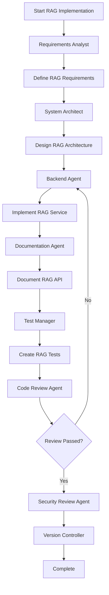

# RAG Implementation Workflow

**Version**: 1.0  
**Last Updated**: 2025-01-21  
**Status**: Active  
**Priority**: High

---

## Overview

This workflow defines the process for implementing a RAG (Retrieval-Augmented Generation) system for the FitVibe multi-agent system. The RAG system will enable agents to retrieve relevant context from the knowledge base and use it to generate more accurate responses.

---

## Workflow Diagram



---

## Workflow Steps

### Phase 1: Requirements & Design (30-45 minutes)

1. **Requirements Analysis** → Requirements Analyst Agent
   - Define RAG system requirements
   - Identify use cases (agent context retrieval, code search, documentation lookup)
   - Define success criteria
   - Identify integration points

2. **Architecture Design** → System Architect Agent
   - Design RAG service architecture
   - Define API endpoints
   - Plan integration with existing vector DB
   - Design chunking strategy
   - Plan LLM integration for generation

### Phase 2: Implementation (1-2 hours)

3. **RAG Service Implementation** → Backend Agent
   - Create RAG service module
   - Implement retrieval logic
   - Integrate with vector DB
   - Implement generation with LLM
   - Add caching layer
   - Implement error handling

4. **Documentation** → Documentation Agent
   - Document RAG API
   - Create usage examples
   - Document integration guide
   - Update TDD

### Phase 3: Testing & Review (30-45 minutes)

5. **Test Generation** → Test Manager
   - Unit tests for RAG service
   - Integration tests with vector DB
   - Test LLM integration
   - Test error handling

6. **Code Review** → Code Review Agent
   - Review RAG implementation
   - Check standards compliance
   - Validate architecture

7. **Security Review** → Security Review Agent
   - Review for prompt injection risks
   - Check input validation
   - Verify sanitization

### Phase 4: Integration & Deployment (15-30 minutes)

8. **Integration** → Backend Agent
   - Integrate RAG with agent executor
   - Add RAG to prompt assembler
   - Update agent definitions

9. **Version Control** → Version Controller
   - Create commit
   - Create PR

---

## Success Criteria

- ✅ RAG service implemented and tested
- ✅ Integration with vector DB working
- ✅ LLM generation working
- ✅ Agents can use RAG for context retrieval
- ✅ Documentation complete
- ✅ Tests passing
- ✅ Security review passed

---

## Requirements

### Functional Requirements

1. **Retrieval**
   - Search vector database for relevant documents
   - Support semantic search
   - Support category filtering
   - Return top-k results

2. **Generation**
   - Use retrieved context in LLM prompts
   - Generate responses with context
   - Handle context window limits

3. **Integration**
   - Integrate with agent executor
   - Integrate with prompt assembler
   - Support agent context retrieval

### Non-Functional Requirements

1. **Performance**
   - Retrieval latency < 500ms
   - Generation latency < 5s
   - Support concurrent requests

2. **Security**
   - Input validation
   - Output sanitization
   - Prompt injection prevention

3. **Reliability**
   - Error handling
   - Fallback mechanisms
   - Retry logic

---

## Technical Design

### RAG Service Architecture

```
RAG Service
├── Retrieval Module
│   ├── Vector DB Integration
│   ├── Query Processing
│   └── Result Ranking
├── Generation Module
│   ├── Context Assembly
│   ├── LLM Integration
│   └── Response Formatting
└── Integration Module
    ├── Agent Executor Integration
    └── Prompt Assembler Integration
```

### API Design

```python
class RAGService:
    def retrieve(
        self,
        query: str,
        n_results: int = 5,
        category: Optional[str] = None
    ) -> List[Dict[str, Any]]
    
    def generate(
        self,
        query: str,
        context: Optional[List[Dict[str, Any]]] = None,
        system_prompt: Optional[str] = None
    ) -> str
    
    def retrieve_and_generate(
        self,
        query: str,
        n_results: int = 5,
        category: Optional[str] = None,
        system_prompt: Optional[str] = None
    ) -> Dict[str, Any]
```

---

**Last Updated**: 2025-01-21


