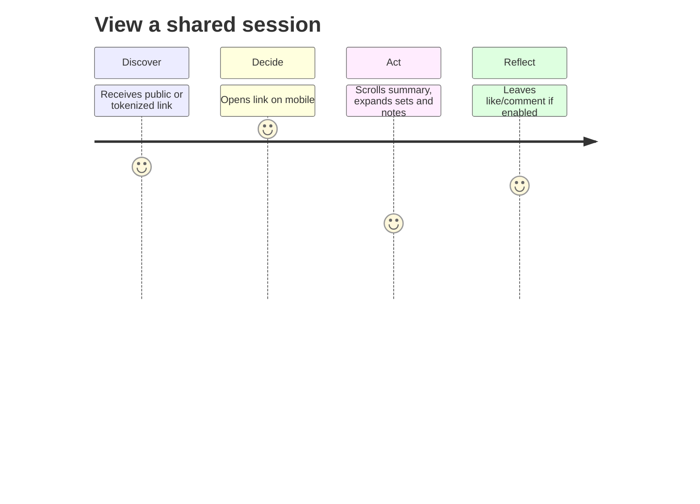
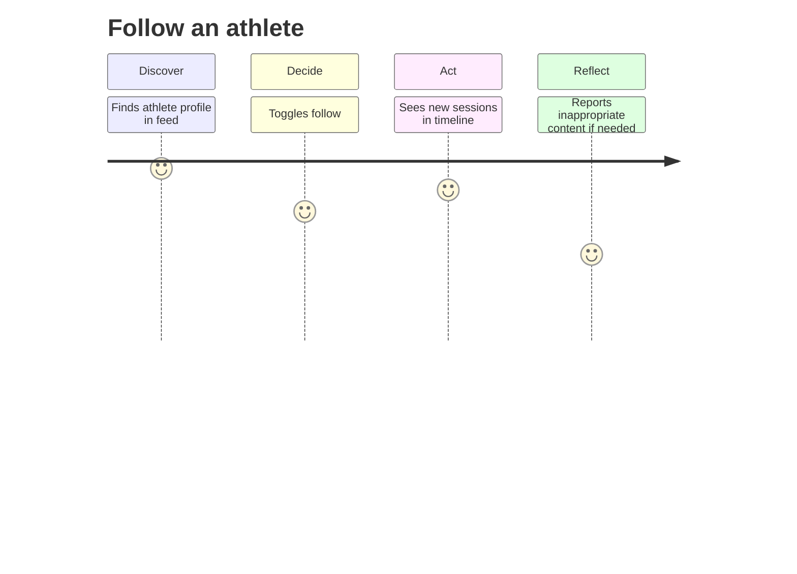

<!-- File: persona-follower.md | Purpose: Persona document with journey maps and acceptance checks -->

# Follower (ID: P-003)

_Version:_ v1.0 • _Date:_ 2025-10-17 • _Author:_ GPT‑5 (FitVibe Assistant)

## Overview

Friend/peer/coach-lite who views public or link-shared sessions and gives lightweight feedback.

## Role & Access (RBAC)

- Role key: `user`
- Access: public or link-only content; read-only. No access to private content.

## Primary Goals

- Track friends
- Motivate athletes
- Get motivated

## Key Tasks

- View a shared session
- Follow an athlete

## Journey Maps

## Acceptance Checks (Gherkin-lite)

- **Fast first paint** — Given a share-link, when opened on 3G, then content is readable ≤ 2.5s LCP.
- **Clear visibility** — Given a session, when viewing, then a badge shows 'Public' or 'Link-only' clearly.
- **Respect privacy** — Given a private session URL guessed, when accessed, then returns 404 without leakage.

## KPIs & Success Metrics

- Feed view-through rate
- Time on session page
- Engagement rate (likes/comments)
- Low report rate

## Risks & Mitigations

- **Harassment/spam** → Rate limits; block/report; moderation hooks.
- **Confusion on visibility** → UI labels; tooltips; link revoke confirmation.

## Traceability

- PRD §3.1 Personas; sharing & privacy (PRD §2, §8).
- TDD: RBAC matrix, API endpoints (sessions, plans, feedback, library).
- QA Plan: performance (LCP < 2.5s, API p95 < 300ms), security, accessibility (WCAG 2.1 AA).
