# FitVibe User Flow Documentation

> **Purpose**: Comprehensive documentation of all pages, user actions, and navigation flows
> **Version**: v1.0
> **Date**: 2025-10-28
> **Status**: Living Document

---

## Table of Contents

1. [Overview](#overview)
2. [Page Inventory](#page-inventory)
3. [Authentication Flows](#authentication-flows)
4. [Main Application Flows](#main-application-flows)
5. [Page Design Templates](#page-design-templates)
6. [Navigation Rules](#navigation-rules)

---

## Overview

This document describes the complete user journey through FitVibe, including:
- **What happens on each page**
- **Actions users can take**
- **Navigation paths between pages**
- **Success/error states**

### Flow Notation

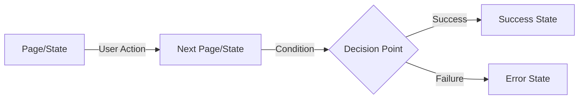

---

## Page Inventory

### Public Pages (No Authentication Required)

| Route | Component | Purpose | Protected |
|-------|-----------|---------|-----------|
| `/` | Home | Landing page with app overview | No |
| `/login` | Login | User authentication | No |
| `/register` | Register | New user registration | No |
| `/forgot-password` | ForgotPassword | Request password reset | No |
| `/reset-password?token=xxx` | ResetPassword | Reset password with token | No |

### Protected Pages (Authentication Required)

| Route | Component | Purpose | Protected |
|-------|-----------|---------|-----------|
| `/dashboard` | Dashboard | User overview & analytics | Yes |
| `/planner` | Planner | Plan workout sessions | Yes |
| `/logger` | Logger | Log workout execution | Yes |
| `/progress` | Progress | View analytics & PRs | Yes |
| `/feed` | Feed | Social feed (if enabled) | Yes |
| `/profile` | Profile | User settings & preferences | Yes |

### Special Pages

| Route | Component | Purpose | Protected |
|-------|-----------|---------|-----------|
| `*` (404) | NotFound | Invalid routes redirect | No |

---

## Authentication Flows

### 1. Registration Flow

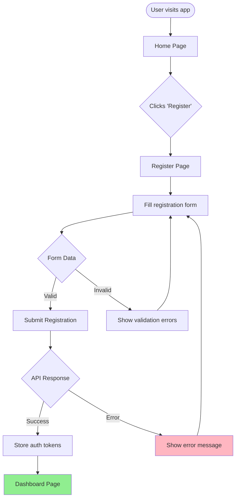

**Page: Register (`/register`)**

**Purpose**: Create new user account

**Form Fields**:
- Name (display_name)
- Email
- Password (min 12 chars, complexity requirements)

**User Actions**:
1. Enter personal information
2. Click "Create account" button
3. Or click "Already have an account? Log in"

**What Happens**:
- Generate username from email (part before @, sanitized)
- Submit `POST /api/v1/auth/register` with:
  ```json
  {
    "email": "user@example.com",
    "password": "SecurePass123!",
    "username": "user",
    "profile": {
      "display_name": "User Name"
    }
  }
  ```
- On success: Store tokens, navigate to `/dashboard`
- On error: Display error message (stays on page)

**Navigation Paths**:
- Success → `/dashboard`
- "Already have account" → `/login`

**Known Issues**:
- Email verification not sent (requires SMTP configuration)
- Currently auto-logs in after registration

---

### 2. Login Flow

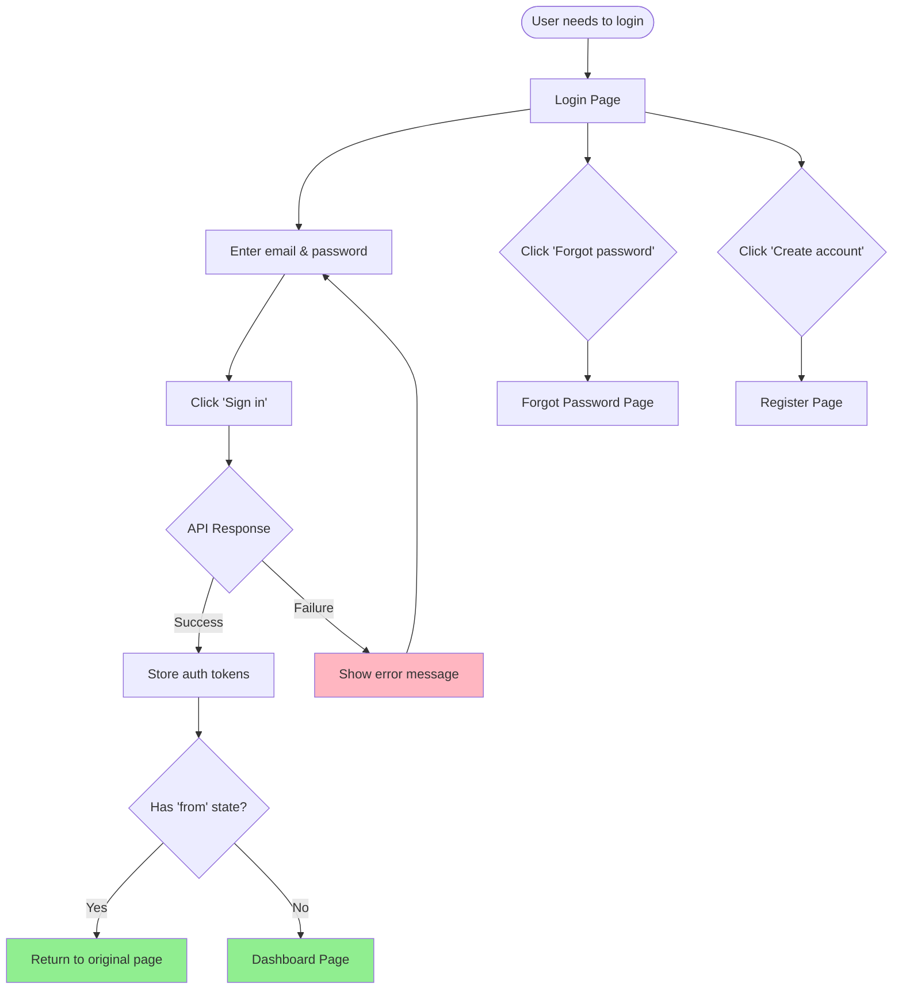

**Page: Login (`/login`)**

**Purpose**: Authenticate existing user

**Form Fields**:
- Email
- Password

**User Actions**:
1. Enter credentials
2. Click "Sign in"
3. Click "Forgot password?" → navigate to `/forgot-password`
4. Click "Create account" → navigate to `/register`

**What Happens**:
- Submit `POST /api/v1/auth/login` with credentials
- Receive `{ accessToken, refreshToken }`
- Store tokens in auth store
- Navigate to dashboard or original destination

**Navigation Paths**:
- Success → `/dashboard` (or return URL from protected route redirect)
- "Forgot password" → `/forgot-password`
- "Create account" → `/register`

---

### 3. Password Reset Flow

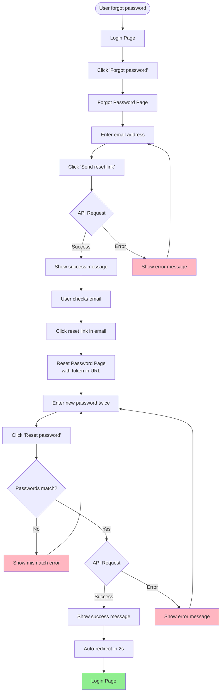

**Page: Forgot Password (`/forgot-password`)**

**Purpose**: Request password reset email

**Form Fields**:
- Email

**User Actions**:
1. Enter email address
2. Click "Send reset link"
3. Click "Back to login"

**What Happens**:
- Submit `POST /api/v1/auth/password/forgot`
- Show success message (doesn't reveal if email exists)
- User receives email with reset link (requires SMTP)

**Navigation Paths**:
- Success → Show confirmation message (stays on page)
- "Back to login" → `/login`

---

**Page: Reset Password (`/reset-password?token=xxx`)**

**Purpose**: Set new password using reset token

**Form Fields**:
- New password
- Confirm new password

**User Actions**:
1. Enter new password (twice)
2. Click "Reset password"
3. Click "Back to login"

**What Happens**:
- Validate passwords match
- Validate password meets policy (min 12 chars, complexity)
- Submit `POST /api/v1/auth/password/reset` with token and new password
- On success: Show success message, auto-redirect to login after 2 seconds

**Navigation Paths**:
- Success → Auto-redirect to `/login` after 2s
- "Back to login" → `/login`

**Error States**:
- Passwords don't match
- Password doesn't meet requirements
- Token invalid/expired
- Network error

---

## Main Application Flows

### 4. Dashboard Flow

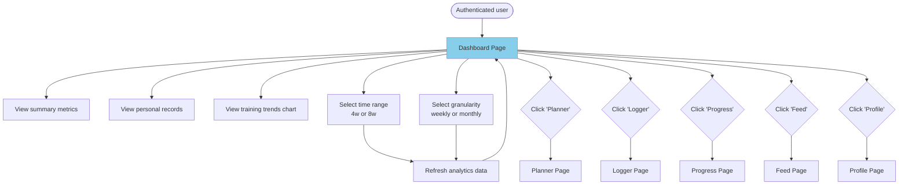

**Page: Dashboard (`/dashboard`)**

**Purpose**: Main overview of user's training activity

**Data Displayed**:
- Training streak (current & change)
- Sessions completed (total & change)
- Total volume (total & change)
- Top 3 personal records
- Training trends chart (volume & sessions over time)

**User Actions**:
1. View summary metrics
2. Select time range (4 weeks or 8 weeks)
3. Select data granularity (weekly or monthly)
4. Navigate to other sections via main navigation

**What Happens**:
- Fetch `GET /api/v1/progress/summary?period=30`
- Fetch `GET /api/v1/progress/trends?period=30&group_by=week`
- Display aggregated analytics
- Auto-refresh when range/grain changes

**Navigation Paths**:
- Main nav → `/planner`, `/logger`, `/progress`, `/feed`, `/profile`

---

### 5. Planner Flow

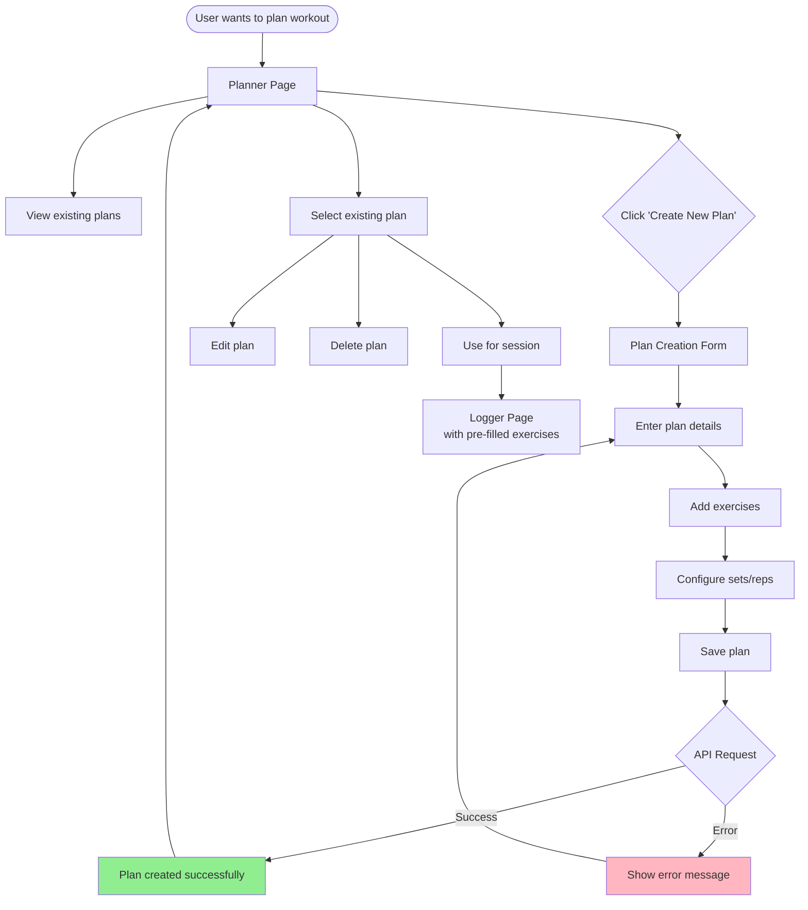

**Page: Planner (`/planner`)**

**Purpose**: Create and manage workout plans/templates

**Data Displayed**:
- List of saved plans
- Plan details (exercises, sets, reps)
- Templates library

**User Actions**:
1. View saved plans
2. Create new plan
3. Edit existing plan
4. Delete plan
5. Use plan for today's session

**What Happens**:
- Fetch user's plans
- CRUD operations on plans
- Navigate to Logger with pre-filled template

**Navigation Paths**:
- "Use plan" → `/logger` (with plan data)
- Main nav → other sections

---

### 6. Logger Flow

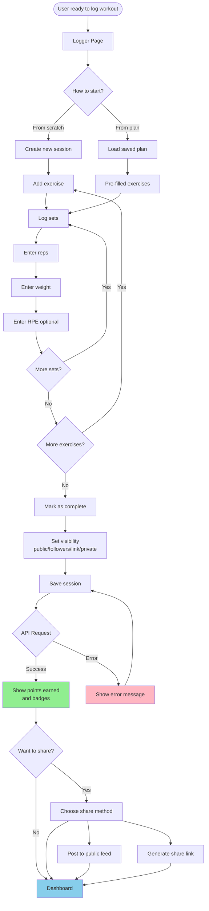

**Page: Logger (`/logger`)**

**Purpose**: Log workout session execution in real-time

**Data Displayed**:
- Current session details
- Exercise list
- Set-by-set logging interface
- Running totals (volume, duration)

**User Actions**:
1. Create new session or load from plan
2. Add exercises
3. Log each set (reps, weight, RPE, tempo, rest)
4. Mark session as complete
5. Set visibility (private/public/followers/link)
6. Share session (optional)

**What Happens**:
- Create session via `POST /api/v1/sessions`
- Add exercises and sets
- Calculate points based on volume/completion
- Award badges if criteria met
- Optionally post to feed or generate share link

**Navigation Paths**:
- After save → `/dashboard` or `/feed`
- Cancel → `/planner` or `/dashboard`

**Key Features**:
- Idempotency protection (repeated saves don't duplicate)
- Auto-save draft (optional)
- Offline support (future enhancement)

---

### 7. Progress Flow

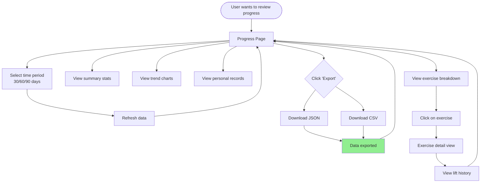

**Page: Progress (`/progress`)**

**Purpose**: View detailed analytics and personal records

**Data Displayed**:
- Total sessions completed
- Total volume lifted
- Current streak
- Personal records (all-time bests)
- Trend charts (volume, sessions, intensity over time)
- Exercise-specific breakdown
- Progress by time period

**User Actions**:
1. Select time period (30/60/90 days or custom)
2. View summary statistics
3. View trend charts
4. Filter by exercise
5. Export data (JSON/CSV)
6. Drill down into specific exercises

**What Happens**:
- Fetch `GET /api/v1/progress/summary?period=X`
- Fetch `GET /api/v1/progress/trends?period=X&group_by=week`
- Fetch `GET /api/v1/progress/exercises?period=X`
- Render charts using Recharts
- Export data via `GET /api/v1/progress/export`

**Navigation Paths**:
- Exercise drill-down → Exercise detail view (modal or separate page)
- Main nav → other sections

---

### 8. Feed Flow (Social Feature)

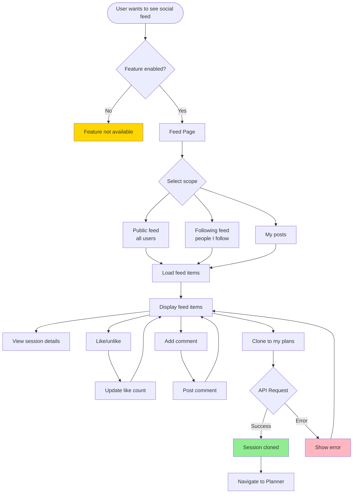

**Page: Feed (`/feed`)**

**Purpose**: Social feed to view and interact with other users' sessions

**Feature Flag**: `FEATURE_SOCIAL_FEED` must be enabled

**Data Displayed**:
- Feed items (session summaries)
- User info (username, display name)
- Session details (exercises, volume, notes)
- Like/comment counts
- Visibility indicator

**User Actions**:
1. Select feed scope (public/following/my posts)
2. View session details
3. Like/unlike sessions
4. Add comments
5. Clone session to own plans
6. Scroll to load more (pagination)

**What Happens**:
- Fetch `GET /api/v1/feed?scope=public&limit=20&offset=0`
- Like via `POST /api/v1/feed/item/{id}/like`
- Unlike via `DELETE /api/v1/feed/item/{id}/like`
- Clone via `POST /api/v1/feed/session/{id}/clone`

**Navigation Paths**:
- Clone session → `/planner` (with cloned data)
- View user profile → `/users/{username}` (future)

**Privacy Note**:
- Only sessions with visibility=public or visibility=followers appear in feed
- Private and link-only sessions are excluded

---

### 9. Profile Flow

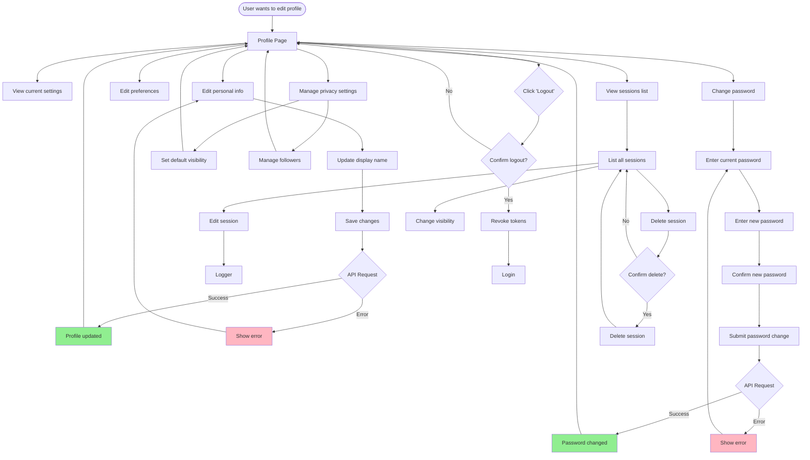

**Page: Profile (`/profile`)**

**Purpose**: Manage user account settings and preferences

**Data Displayed**:
- Personal information (name, email, username)
- Preferences (language, units, theme)
- Privacy settings (default visibility)
- Account statistics
- Session history list

**User Actions**:
1. Edit personal information
2. Change password
3. Update preferences (language, units)
4. Manage privacy settings
5. View/edit/delete sessions
6. Manage followers (if social enabled)
7. Logout

**What Happens**:
- Update profile via `PATCH /api/v1/users/profile`
- Change password via `POST /api/v1/auth/password/change`
- Update preferences via `PATCH /api/v1/users/preferences`
- Logout via token revocation

**Navigation Paths**:
- Logout → `/login`
- Edit session → `/logger`

---

## Page Design Templates

### Template: Standard Page Structure

Every page should follow this structure:

```tsx
import React, { useState } from "react";
import { useNavigate } from "react-router-dom";
import { useTranslation } from "react-i18next";
import PageIntro from "../components/PageIntro";
import { Button } from "../components/ui";

const PageName: React.FC = () => {
  const { t } = useTranslation();
  const navigate = useNavigate();

  // State management
  const [data, setData] = useState<Type>(initialValue);
  const [isLoading, setIsLoading] = useState(false);
  const [error, setError] = useState<string | null>(null);

  // Event handlers
  const handleAction = async () => {
    setError(null);
    setIsLoading(true);

    try {
      // API call
      await apiFunction(data);
      // Success handling
      navigate("/next-page");
    } catch (err) {
      // Error handling
      setError("Error message");
    } finally {
      setIsLoading(false);
    }
  };

  return (
    <PageIntro
      eyebrow={t("page.eyebrow")}
      title={t("page.title")}
      description={t("page.description")}
    >
      {/* Page content */}
      {error && <ErrorMessage>{error}</ErrorMessage>}
      <Button onClick={handleAction} isLoading={isLoading}>
        {t("page.action")}
      </Button>
    </PageIntro>
  );
};

export default PageName;
```

### Template: Page Design Checklist

When designing a new page, answer these questions:

**1. Purpose**
- [ ] What is the primary goal of this page?
- [ ] What problem does it solve for the user?

**2. User Entry**
- [ ] How does the user arrive at this page?
- [ ] What's their mental state/context?
- [ ] What information do they already have?

**3. Content**
- [ ] What data needs to be displayed?
- [ ] What actions can the user take?
- [ ] What's the visual hierarchy?

**4. Interactions**
- [ ] What can the user click/tap?
- [ ] What forms need to be filled?
- [ ] What validations are required?

**5. States**
- [ ] Loading state (what shows while fetching data?)
- [ ] Success state (what confirms success?)
- [ ] Error state (what shows when things fail?)
- [ ] Empty state (what shows when no data?)

**6. Navigation**
- [ ] Where can the user go next?
- [ ] What triggers navigation?
- [ ] Can they go back? How?

**7. API Integration**
- [ ] What endpoints are called?
- [ ] What data is sent?
- [ ] What data is received?
- [ ] How are errors handled?

**8. Accessibility**
- [ ] Keyboard navigation works?
- [ ] ARIA labels present?
- [ ] Color contrast sufficient?
- [ ] Screen reader friendly?

**9. Responsiveness**
- [ ] Mobile layout defined?
- [ ] Tablet layout defined?
- [ ] Desktop layout defined?

**10. Internationalization**
- [ ] All text in translation files?
- [ ] Date/time formatting locale-aware?
- [ ] Number formatting locale-aware?

---

## Navigation Rules

### Protected Route Behavior

```tsx
// If user tries to access protected route without auth:
<Navigate to="/login" state={{ from: location }} replace />

// After successful login:
const from = location.state?.from?.pathname || "/dashboard";
navigate(from, { replace: true });
```

### Navigation Patterns

**1. Linear Flow** (Registration, Password Reset)
```
Step 1 → Step 2 → Step 3 → Success
```

**2. Hub-and-Spoke** (Dashboard as hub)
```
Dashboard ←→ Planner
Dashboard ←→ Logger
Dashboard ←→ Progress
Dashboard ←→ Feed
Dashboard ←→ Profile
```

**3. Hierarchical** (Drill-down)
```
Progress → Exercise List → Exercise Detail → Session Detail
```

**4. Modal/Overlay** (Non-page navigation)
```
Current Page → Modal (confirmation, details) → Current Page
```

### Back Button Behavior

| Page | Back Button Should |
|------|-------------------|
| Dashboard | Not applicable (home) |
| Planner | Go to Dashboard |
| Logger | Confirm unsaved changes, then go back |
| Progress | Go to Dashboard |
| Feed | Go to Dashboard |
| Profile | Go to Dashboard |
| Login | Go to Home |
| Register | Go to Home |
| Forgot Password | Go to Login |
| Reset Password | Go to Login |

---

## Quick Reference: Complete Flow Map

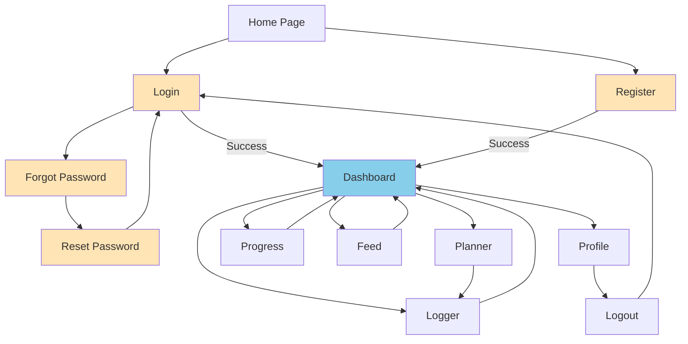

---

## Appendix: Future Enhancements

### Planned Pages (Not Yet Implemented)

1. **Email Verification Page** (`/verify-email?token=xxx`)
   - Verify email after registration
   - Resend verification email

2. **Exercise Library** (`/exercises`)
   - Browse all exercises
   - Create custom exercises
   - View exercise details

3. **Session Detail View** (`/sessions/{id}`)
   - Full session details
   - Share options
   - Edit/delete actions

4. **User Profile (Public)** (`/users/{username}`)
   - View other user's public profile
   - See their public sessions
   - Follow/unfollow

5. **Coach Dashboard** (`/coach`) - Feature flagged
   - Manage athletes
   - Review programs
   - Track progress

6. **Insights/Analytics** (`/insights`) - Feature flagged
   - Advanced analytics
   - Trend predictions
   - Recommendations

---

## Document Maintenance

**Update this document when**:
- Adding new pages
- Changing navigation flows
- Modifying user actions
- Adding/removing features

**Version History**:
- v1.0 (2025-10-28): Initial documentation with all authentication and main app flows
