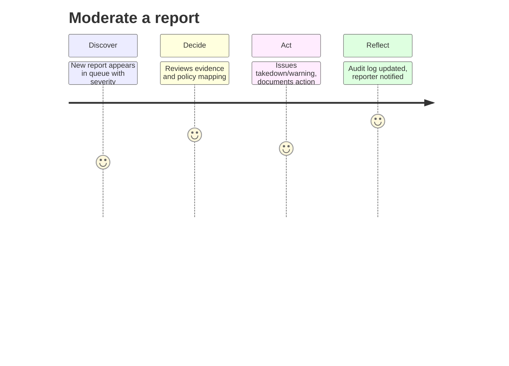
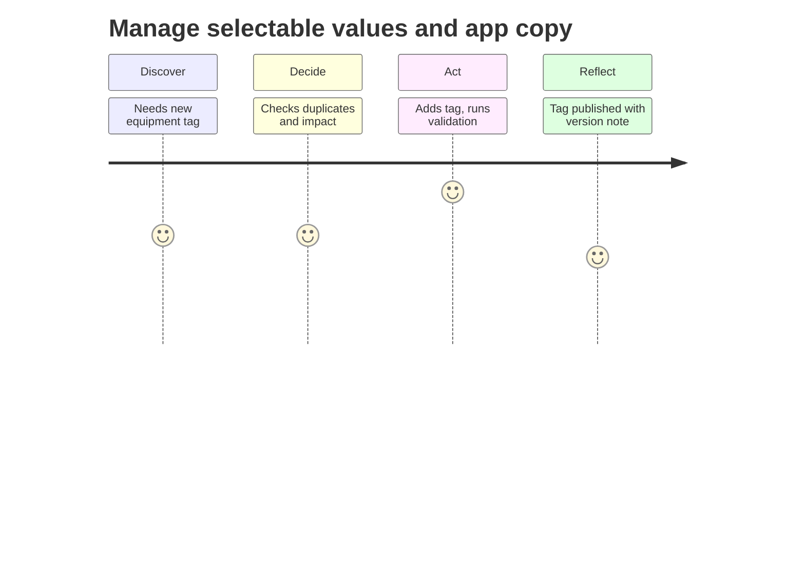

<!-- File: persona-administrator.md | Purpose: Persona document with journey maps and acceptance checks -->

# Administrator (ID: P-002)

_Version:_ v1.0 • _Date:_ 2025-10-17 • _Author:_ GPT‑5 (FitVibe Assistant)

## Overview

Platform operator focused on moderation, rule enforcement, and platform health.

## Role & Access (RBAC)

- Role key: `admin`
- Access: moderation tools, selectable values, audit; cannot bypass user privacy without lawful basis.

## Primary Goals

- Deliver outcomes efficiently
- Stay within privacy & security constraints
- Maintain high product quality and performance

## Key Tasks

- Moderate a report
- Manage selectable values

## Journey Maps

## Acceptance Checks (Gherkin-lite)

- **Time-to-action** — Given a new report, when opened, then required metadata pre-fills and an action can be taken in ≤ 2 minutes.
- **Least privilege** — Given admin access, when viewing private user data, then access is blocked unless lawful basis and explicit elevation.
- **Complete audit** — Given a moderation action, when saved, then audit log stores who/what/when/why with immutable hash.

## KPIs & Success Metrics

- Median time-to-first-action on reports
- 0 critical policy misses per month
- Audit completeness 100%
- Backlog older than 7 days = 0

## Risks & Mitigations

- **Overreach into privacy** → Strict RBAC; escalation gates; purpose limitation banners.
- **Inconsistent actions** → Policy playbooks; action templates; peer review for high severity.

## Traceability

- PRD §3.1 Personas; sharing & privacy (PRD §2, §8).
- TDD: RBAC matrix, API endpoints (sessions, plans, feedback, library).
- QA Plan: performance (LCP < 2.5s, API p95 < 300ms), security, accessibility (WCAG 2.1 AA).
