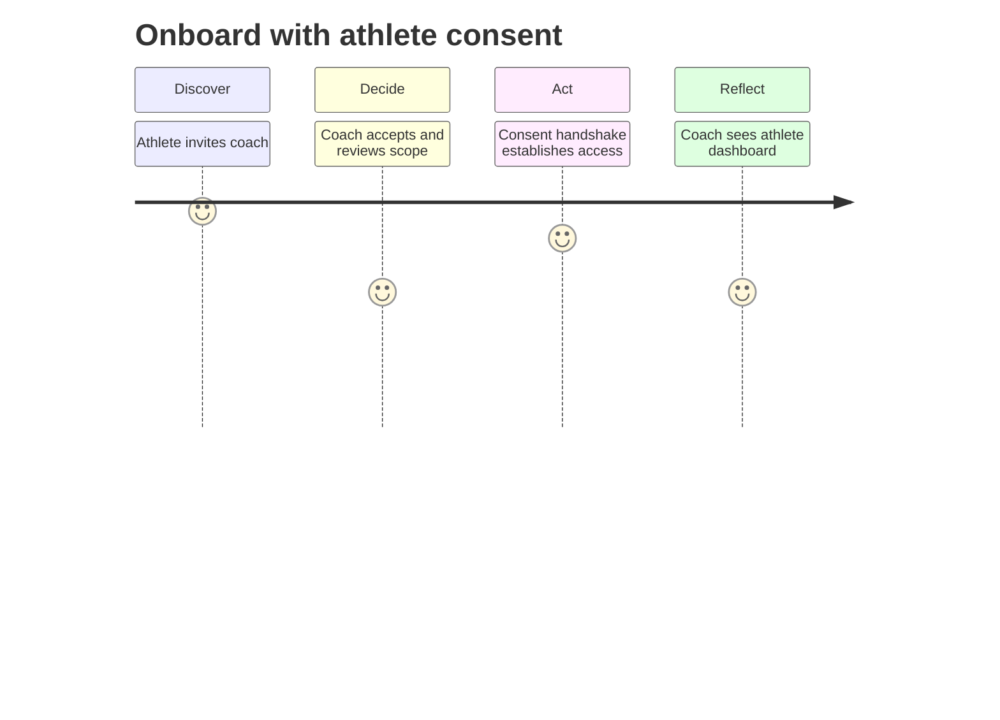
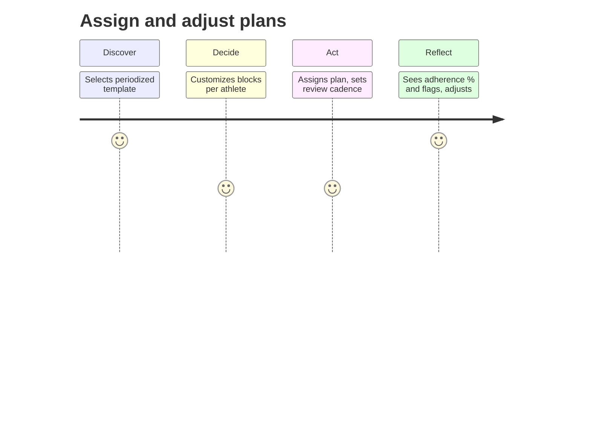
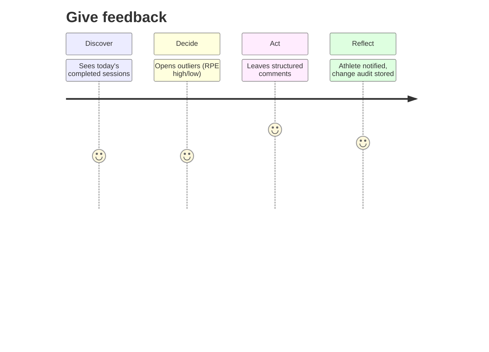

<!-- File: persona-coach-trainer.md | Purpose: Persona document with journey maps and acceptance checks -->

# Coach / Trainer (ID: P-004)

_Version:_ v1.0 • _Date:_ 2025-10-17 • _Author:_ GPT‑5 (FitVibe Assistant)

## Overview

Certified coach or experienced athlete managing plans and feedback for one or more Members.

## Role & Access (RBAC)

- Role key: `coach`
- Access: scoped per athlete via explicit consent; plan/feedback endpoints; no PII beyond handle/name.

## Primary Goals

- Deliver outcomes efficiently
- Stay within privacy & security constraints
- Maintain high product quality and performance

## Key Tasks

- Onboard with athlete consent
- Assign and adjust plans
- Give feedback

## Journey Maps

### Give feedback

## Acceptance Checks (Gherkin-lite)

- **Consent boundary** — Given no consent, when coach tries to open athlete data, then access is denied with guidance to request consent.
- **Bulk assignment** — Given a team of 5 athletes, when assigning a 4-week plan, then all assignments complete ≤ 3s with audit entries.
- **Scoped access** — Given coach has 'plans+feedback' scope only, when attempting profile edits, then blocked and logged.

## KPIs & Success Metrics

- Plan adherence % per athlete
- Median time-to-adjust after flag
- Coach retention / athlete churn
- Feedback coverage (sessions with feedback)

## Risks & Mitigations

- **Over-permissioning** → Scoped tokens per athlete; revocation UI; periodic reviews.
- **Version drift of plans** → Versioned templates; diff view; change history.

## Traceability

- PRD §3.1 Personas; sharing & privacy (PRD §2, §8).
- TDD: RBAC matrix, API endpoints (sessions, plans, feedback, library).
- QA Plan: performance (LCP < 2.5s, API p95 < 300ms), security, accessibility (WCAG 2.1 AA).
