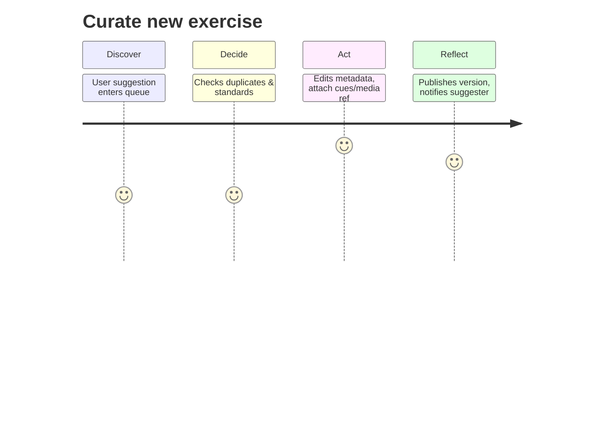
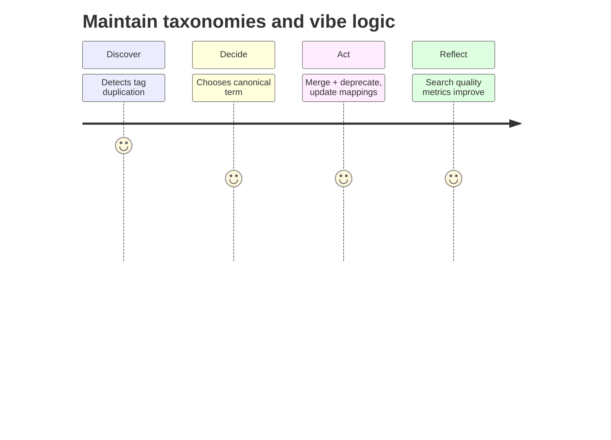

<!-- File: persona-content-curator.md | Purpose: Persona document with journey maps and acceptance checks -->

# Content Curator (ID: P-005)

_Version:_ v1.0 • _Date:_ 2025-10-17 • _Author:_ GPT‑5 (FitVibe Assistant)

## Overview

Admin-lite role maintaining global exercise library and controlled vocabularies.

## Role & Access (RBAC)

- Role key: `curator`
- Access: global library and taxonomies; no Trust & Safety actions; no private user content.

## Primary Goals

- Deliver outcomes efficiently
- Stay within privacy & security constraints
- Maintain high product quality and performance

## Key Tasks

- Curate new exercise
- Maintain taxonomies and vibe logic

## Journey Maps

## Acceptance Checks (Gherkin-lite)

- **Duplicate detection** — Given a new exercise proposal, when submitted, then near-duplicate suggestions are surfaced with similarity score.
- **Draft → Publish** — Given an edited item, when published, then a new immutable version is created and consumers are notified of changes.
- **Non-destructive merges** — Given two tags merged, when users search old term, then they are redirected to the new canonical term.

## KPIs & Success Metrics

- Library coverage and deduplication rate
- Search no-result rate ↓
- Median time-to-approve suggestion
- Rollback frequency (should be low)

## Risks & Mitigations

- **Taxonomy drift** → Scheduled audits; governance rules; review gates.
- **Breaking changes** → Versioning; deprecation notices; impact analyzer.

## Traceability

- PRD §3.1 Personas; sharing & privacy (PRD §2, §8).
- TDD: RBAC matrix, API endpoints (sessions, plans, feedback, library).
- QA Plan: performance (LCP < 2.5s, API p95 < 300ms), security, accessibility (WCAG 2.1 AA).
