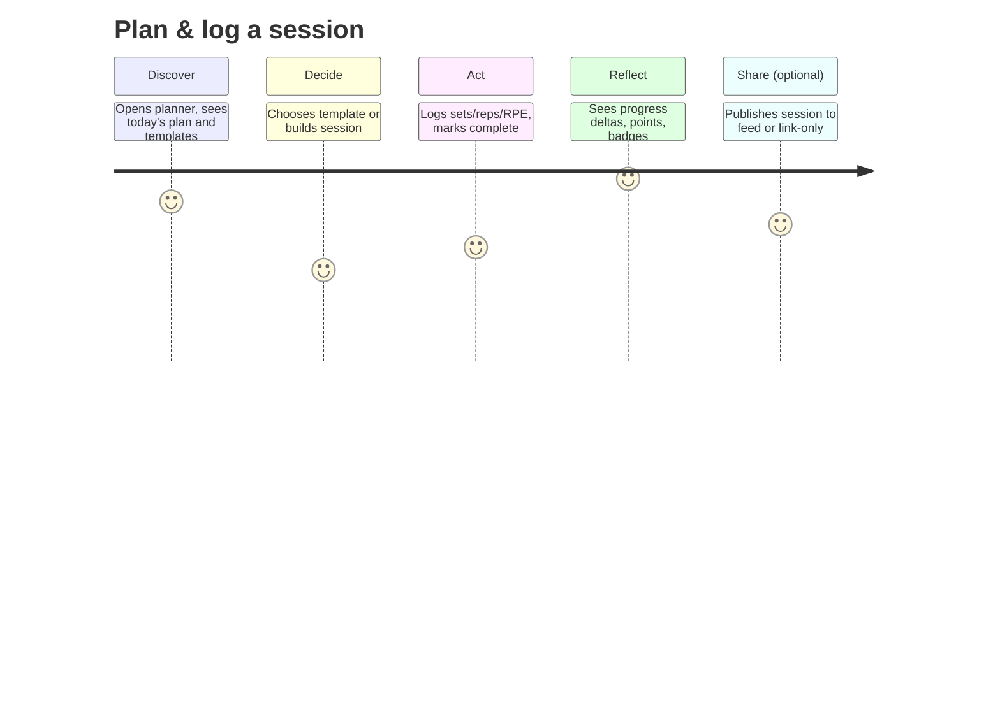
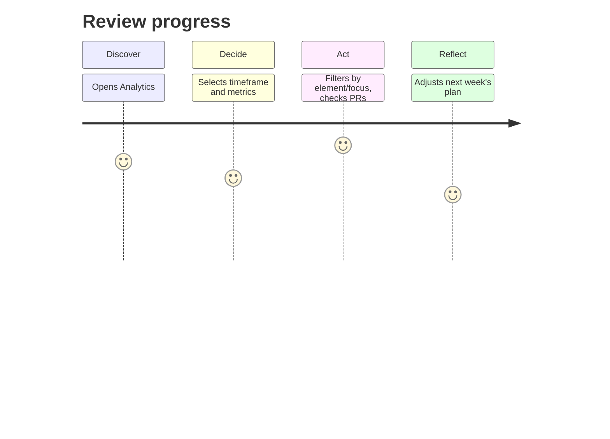
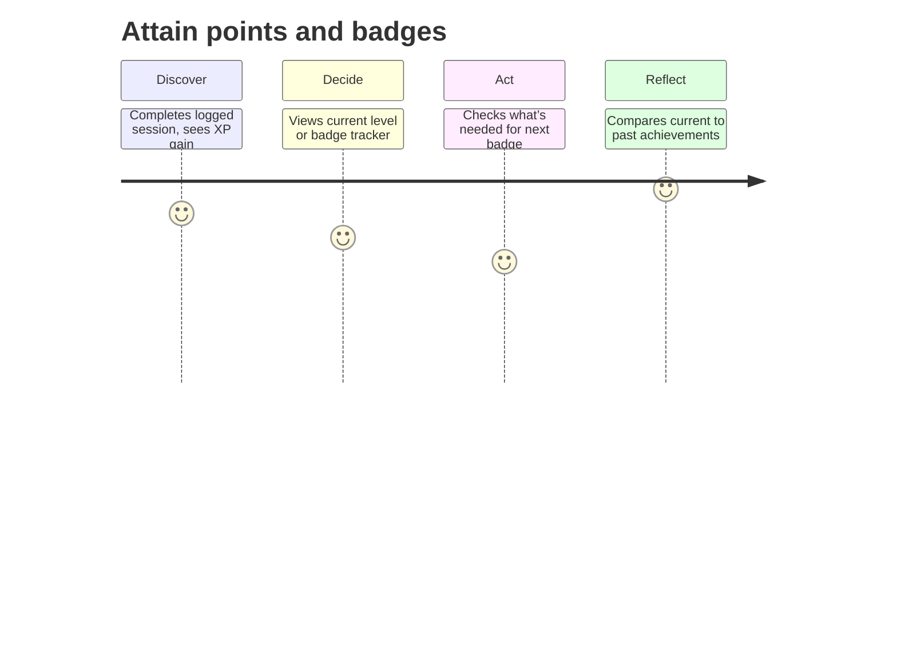
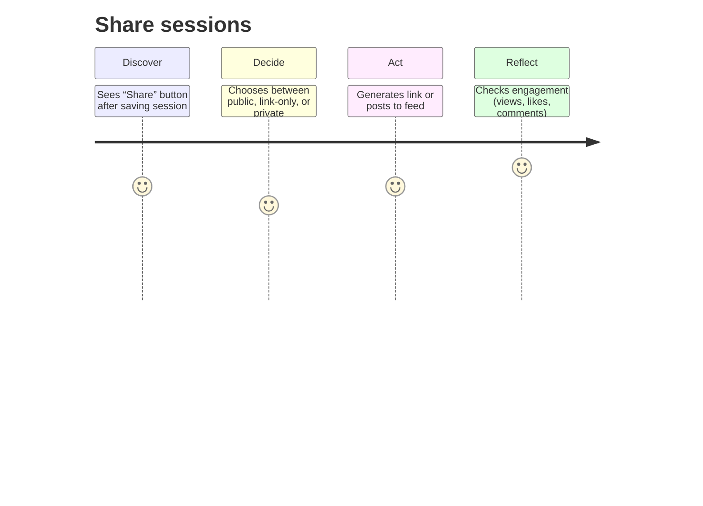

<!-- File: persona-member-athlete.md | Purpose: Persona document with journey maps and acceptance checks -->

# Member (Athlete) (ID: P-001)

_Version:_ v1.0 • _Date:_ 2025-10-17 • _Author:_ GPT‑5 (FitVibe Assistant)

## Overview

Everyday to advanced trainee who plans, logs, and reviews training; may share selected sessions.

## Role & Access (RBAC)

- Role key: `user`
- Access: full control over own content; private by default; share optional.

## Primary Goals

- Track progress efficiently
- Be protected by privacy & security constraints
- Profit from large exercise library

## Key Tasks

- Plan & log a session
- Review progress
- Attains points and badges.
- Shares sessions.

## Journey Maps

## Acceptance Checks (Gherkin-lite)

- **Plan quickly** — Given I am on the planner, when I add ≥3 exercises and 1 superset, then save succeeds ≤1.5s and the session appears in 'Today'.
- **Frictionless logging** — Given a completed set, when I input weight/reps with keyboard only, then the row validates inline and totals update without page reload.
- **Idempotent save** — Given intermittent network, when I tap save repeatedly, then only one session is created (idempotency-key enforced).
- **Privacy by default** — Given a new session, when I do nothing, then it remains private and is not visible in public feed.
- **Share via link** — Given I generate a share-link, when I open it in a private window, then the session is viewable without sign-in and the token can be revoked.

## KPIs & Success Metrics

- Median time to plan+log ≤ 90s
- Weekly active sessions per user
- Completion rate (% planned completed)
- Share rate (% sessions shared)
- Error rate < 0.5% writes

## Risks & Mitigations

- **Slow data entry** → Client-side caching & offline queue; keyboard-first UX; batch inputs.
- **Duplicate submissions** → Idempotency keys on writes; retry-safe API.
- **Confusing privacy** → Clear toggles, banners, and visibility labels; defaults to private.

## Traceability

- PRD §3.1 Personas; sharing & privacy (PRD §2, §8).
- TDD: RBAC matrix, API endpoints (sessions, plans, feedback, library).
- QA Plan: performance (LCP < 2.5s, API p95 < 300ms), security, accessibility (WCAG 2.1 AA).
