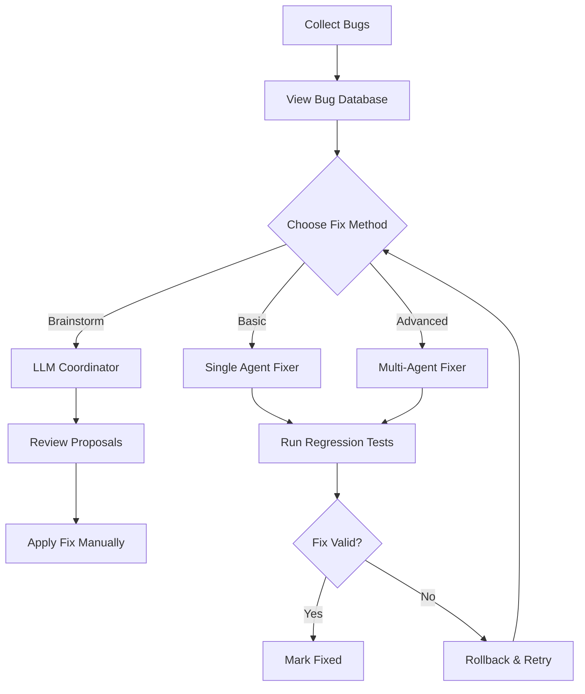

# Bug Fixing Agent System - User Guide

**Date:** 2025-01-26
**Version:** 1.0

---

## Overview

The FitVibe bug fixing agent system provides systematic bug collection and fixing capabilities with multi-agent collaboration and LLM-powered solutions. The system is designed to fix bugs without breaking functionality through comprehensive regression testing and safety mechanisms.

---

## Architecture

### Components

1. **Bug Collector** (`.cursor/scripts/bug-collector.mjs`)
   - Collects bugs from all sources (tests, linter, type checker)
   - Maintains persistent bug database
   - Tracks bug history and statistics

2. **Bug Fixer Agent** (`.cursor/scripts/bug-fixer-agent.mjs`)
   - Basic single-agent fixing with safety mechanisms
   - Regression testing and rollback
   - Attempt limiting

3. **Multi-Agent Bug Fixer** (`.cursor/scripts/bug-fixer-multi-agent.mjs`)
   - Enhanced multi-agent collaboration
   - Specialized agents (Guide, Debug, Feedback, Brainstorm)
   - Continuous learning from past fixes

4. **Brainstorm Coordinator** (`.cursor/scripts/bug-brainstorm-coordinator.mjs`)
   - Coordinates multiple LLMs for diverse perspectives
   - Consensus finding
   - Fix proposal generation

---

## Quick Start

### 1. Collect Bugs

```bash
# Collect all bugs from tests, linter, and type checker
node .cursor/scripts/bug-collector.mjs
```

Or use the npm script:
```bash
pnpm bug:collect
```

This will:

- Run all test suites
- Check linter errors
- Check TypeScript errors
- Save bugs to `.cursor/bug-database/bugs.json`

### 2. View Bugs

```bash
# View bug database
cat .cursor/bug-database/bugs.json | jq '.stats'
cat .cursor/bug-database/bugs.json | jq '.bugs[] | select(.status == "open")'
```

### 3. Fix Bugs

#### Option A: Basic Agent (Single Agent)

```bash
# Run basic bug fixer
node .cursor/scripts/bug-fixer-agent.mjs
```

Or use the npm script:
```bash
pnpm bug:fix
```

#### Option B: Multi-Agent System (Recommended)

```bash
# Run multi-agent bug fixer
node .cursor/scripts/bug-fixer-multi-agent.mjs
```

Or use the npm script:
```bash
pnpm bug:fix:multi
```

#### Option C: Brainstorm with Multiple LLMs

```bash
# Brainstorm solutions for a specific bug
node .cursor/scripts/bug-brainstorm-coordinator.mjs <bug-id>

# Brainstorm for all open bugs
node .cursor/scripts/bug-brainstorm-coordinator.mjs --all
```

Or use the npm script:
```bash
pnpm bug:brainstorm <bug-id>
pnpm bug:brainstorm --all
```

---

## Workflow

### Standard Workflow



### Multi-Agent Workflow

1. **Guide Agent** analyzes bug and creates fix strategy
2. **Debug Agent** performs root cause analysis
3. **Brainstorm Agent** coordinates multiple LLMs for solutions
4. **Fix Application** applies the consensus solution
5. **Feedback Agent** validates the fix
6. **Regression Tests** ensure no functionality broken
7. **History Update** records fix for learning

---

## Bug Database Structure

```json
{
  "version": "1.0.0",
  "lastUpdated": "2025-01-26T10:00:00Z",
  "bugs": [
    {
      "id": "typescript-apps-backend-src-example-ts-42",
      "type": "type-error",
      "category": "type-safety",
      "severity": "high",
      "file": "apps/backend/src/example.ts",
      "line": 42,
      "message": "Type 'string' is not assignable to type 'number'",
      "status": "open",
      "createdAt": "2025-01-26T09:00:00Z",
      "updatedAt": "2025-01-26T10:00:00Z",
      "attempts": 0,
      "fixed": false
    }
  ],
  "stats": {
    "total": 10,
    "open": 5,
    "fixed": 5,
    "byType": {
      "type-error": 3,
      "test-failure": 2,
      "linter-error": 5
    },
    "bySeverity": {
      "high": 2,
      "medium": 5,
      "low": 3
    }
  }
}
```

---

## Agent Roles

### Guide Agent

- **Role:** Strategy and planning
- **Responsibilities:**
  - Analyze bug type and category
  - Create fix strategy
  - Estimate complexity
  - Learn from similar past fixes

### Debug Agent

- **Role:** Root cause analysis
- **Responsibilities:**
  - Trace error origins
  - Identify dependency chains
  - Analyze error context
  - Provide diagnostic information

### Brainstorm Agent

- **Role:** Solution generation
- **Responsibilities:**
  - Coordinate multiple LLMs
  - Generate diverse perspectives
  - Find consensus solutions
  - Evaluate solution quality

### Feedback Agent

- **Role:** Validation and feedback
- **Responsibilities:**
  - Validate fixes
  - Check regression tests
  - Provide quality scores
  - Suggest improvements

---

## Safety Mechanisms

### 1. File Backups

- All files are backed up before modification
- Backups stored as `.bug-fix-backup` files
- Automatic restoration on failure

### 2. Regression Testing

- Full test suite after each fix
- Type checking
- Linter validation
- Automatic rollback on failure

### 3. Attempt Limiting

- Maximum 3 attempts per bug
- Prevents infinite loops
- Marks bugs as "blocked" after max attempts

### 4. Confidence Scoring

- Each fix has confidence score
- Low confidence fixes require review
- Consensus-based validation

---

## LLM Integration

### Current Status

The system is designed for LLM integration but currently uses placeholders. To enable actual LLM fixing:

1. **Set API Keys:**

   ```bash
   export OPENAI_API_KEY="your-key"
   export ANTHROPIC_API_KEY="your-key"
   ```

2. **Implement API Calls:**
   - Update `callLLM()` in `.cursor/scripts/bug-brainstorm-coordinator.mjs`
   - Update `applyFix()` in `.cursor/scripts/bug-fixer-multi-agent.mjs`

3. **Supported Providers:**
   - OpenAI (GPT-4, GPT-3.5)
   - Anthropic (Claude 3)
   - Local models (via API)

### Brainstorming with Multiple LLMs

The brainstorm coordinator can query multiple LLMs simultaneously:

```bash
# Brainstorm for specific bug
node .cursor/scripts/bug-brainstorm-coordinator.mjs jest-test-file-test-name

# Review generated proposals
cat .cursor/bug-database/brainstorm-results.json | jq '.[0].consensus'
```

---

## Best Practices

### 1. Regular Bug Collection

Run bug collection frequently:

```bash
# In CI/CD pipeline
node .cursor/scripts/bug-collector.mjs
```

Or use the npm script:
```bash
pnpm bug:collect
```

### 2. Prioritize High-Severity Bugs

The system automatically prioritizes:

- Critical/High severity first
- Type errors before linter errors
- Fewer attempts first

### 3. Review Low-Confidence Fixes

Fixes with confidence < 70% should be reviewed manually before applying.

### 4. Monitor Fix History

Check fix history for patterns:

```bash
cat .cursor/bug-database/fix-history.json | jq '.fixes[] | select(.success == false)'
```

### 5. Use Multi-Agent for Complex Bugs

For complex bugs, use the multi-agent system:

```bash
node .cursor/scripts/bug-fixer-multi-agent.mjs
```

Or use the npm script:
```bash
pnpm bug:fix:multi
```

---

## Troubleshooting

### Bug Collection Fails

- Check test suite is runnable
- Verify linter configuration
- Ensure TypeScript is configured

### Fixes Not Applying

- Check file permissions
- Verify file paths are correct
- Check backup files exist

### Regression Tests Failing

- Review test output
- Check for flaky tests
- Verify test environment

### LLM Integration Not Working

- Verify API keys are set
- Check API rate limits
- Review API response format

---

## Advanced Usage

### Custom Prioritization

Modify `prioritizeBugs()` in the fixer scripts to customize bug ordering.

### Custom Regression Tests

Add custom tests to `runRegressionTests()` function.

### Learning from Fixes

The system learns from past fixes. Review `fix-history.json` to see patterns.

### Integration with CI/CD

Add to CI pipeline:

```yaml
- name: Collect Bugs
  run: node .cursor/scripts/bug-collector.mjs
  # Or: run: pnpm bug:collect

- name: Fix Bugs
  run: node .cursor/scripts/bug-fixer-multi-agent.mjs
  # Or: run: pnpm bug:fix:multi
  continue-on-error: true
```

---

## Limitations

1. **LLM Integration:** Currently uses placeholders - requires API integration
2. **Dynamic Analysis:** Limited runtime debugging capabilities
3. **Complex Fixes:** May require manual intervention for complex bugs
4. **Flaky Tests:** Not automatically detected (planned feature)

---

## Future Enhancements

- [ ] Full LLM API integration
- [ ] Dynamic runtime analysis
- [ ] Flaky test detection
- [ ] Automated test generation
- [ ] Visual dashboard
- [ ] Predictive bug detection

---

## References

- [Best Practices Comparison](./Bug_Fixing_Agent_Comparison.md)
- [Multi-Agent Architecture](../2.Technical_Design_Document/2.f.Architectural_Decision_Documentation/)
- [Testing Plan](./4a.Testing_and_Quality_Assurance_Plan.md)
